

# TERRA-AUDIT

## AI-ASSISTED DIGITAL MRV PLATFORM FOR AWD RICE IRRIGATION CARBON CREDITS

### SOFTWARE REQUIREMENTS SPECIFICATION & ANALYSIS

 

**Submitted By:**\
Kazi Nahid | BSSE-1437\
Md. Jariful Rahman | BSSE-1419

 

**Submitted To:**\
Dr. Mohammed Shafiul Alam Khan\
Professor\
Institute of Information Technology\
University of Dhaka

 

**Supervisor's Signature:** \_\_\_\_\_\_\_\_\_\_\_\_\_\_\_\_\_\_\_\_\_\_\_\_

 

**IIT — University of Dhaka**

---

# Table of Contents

- [1. Introduction](#1-introduction)
  - 1.1 Purpose
  - 1.2 Intended Audience
  - 1.3 Usage Scenarios
  - 1.4 Conclusion
- [2. Inception](#2-inception)
  - 2.1 Understanding the Problem
  - 2.2 Icebreaking
  - 2.3 Identifying the Stakeholders
  - 2.4 Stakeholder Viewpoints
  - 2.5 Working Towards Collaboration
  - 2.6 Elicitation of Terra-Audit
- [3. Quality Function Deployment](#3-quality-function-deployment)
  - 3.1 Normal Requirements
  - 3.2 Exciting Requirements
- [4. User Story](#4-user-story)
- [5. Scenario Based Modeling](#5-scenario-based-modeling)
  - 5.1 Use Case Diagram (Level 0, 1, 1.1, 1.1.1, 1.1.2, 1.2 – 1.6)
  - 5.2 Activity Diagram (Level 1, 1.1, 1.1.1, 1.2 – 1.6)
- [6. Data Based Modeling](#6-data-based-modeling)
  - 6.1 Noun Identification
  - 6.2 Final Data Objects
  - 6.3 Relations
  - 6.4 ER Diagram
  - 6.5 Schema Diagram
- [7. Class Based Diagram](#7-class-based-diagram)
  - 7.1 Identified Nouns
  - 7.2 Identified Verbs
  - 7.3 General Classification
  - 7.4 Selection Criteria
  - 7.5 Class Card
  - 7.8 CRC Diagram
- [8. Behavioral Diagram](#8-behavioral-diagram)
  - 8.1 Event Table
  - 8.2 State Transition Diagram
  - 8.3 Sequence Diagram
- [9. Data Flow Diagram](#9-data-flow-diagram)
  - 9.1 Level 0: Terra-Audit
  - 9.2 Level 1: Terra-Audit
- [10. References](#10-references)

---

# 1. Introduction

Terra-Audit is envisioned as a low-cost, satellite-only digital MRV
(Measurement, Reporting and Verification) platform for rice-cultivation
carbon projects. Alternate Wetting and Drying (AWD) irrigation reduces
methane emissions from rice paddies, but proving that a farmer actually
practiced AWD has traditionally required manual logs or expensive
water-level sensors. Terra-Audit replaces those with Sentinel-1 SAR
satellite observations pulled from Google Earth Engine, detects AWD
drydown events in the radar signal, converts the observed behavior into
carbon credit estimates under the Verra VM0051 Tier 2 (QA3) methodology,
and packages the entire calculation into auditor-ready evidence files.

## 1.1 Purpose

Terra-Audit aims to provide carbon project developers, researchers and
auditors with an intuitive and verifiable environment for turning
satellite radar signals into carbon credit evidence. The platform
combines field boundary management, Sentinel-1 time-series analytics,
rule-based and AI-assisted AWD event detection, VM0051-aligned carbon
accounting, and one-click export of a complete evidence package (PDF,
JSON, CSV). By integrating exciting features like machine-learning AWD
detection with per-prediction confidence and automatic phenology-derived
season detection, Terra-Audit makes smallholder rice carbon projects in
Bangladesh and South Asia measurable without any on-the-ground hardware.

## 1.2 Intended Audience

The primary audience for this SRS document includes:

- **Developers:** To understand the functional requirements, module
  boundaries and calculation logic for implementing the platform.
- **Project Managers:** To plan and allocate resources efficiently.
- **Stakeholders:** To review and provide feedback on the project's
  goals and requirements.
- **Quality Assurance Team:** To ensure all features are delivered as
  specified, especially the traceability of every carbon number.
- **End Users:** Carbon project developers, agronomy researchers and
  third-party auditors who will use the platform to generate and verify
  AWD carbon credit evidence.

## 1.3 Usage Scenarios

**Scenario 1: Registering a Field and Running Signal Analytics**

1. A carbon project developer opens Terra-Audit and draws a rice paddy
   boundary on the interactive map (or uploads a GeoJSON/KML file, or
   pastes GPS coordinates).
2. The system computes the field area automatically and the developer
   saves the field with an ID, name and district.
3. The developer selects a monitoring season (e.g., "Boro 2026") and
   runs the analytics engine.
4. Terra-Audit checks its local cache, fetches any missing Sentinel-1
   observations from Google Earth Engine, smooths the signal, and marks
   flooded states and AWD drydown events on an interactive chart.
5. Sowing and harvest dates are derived from the VH phenology signal and
   the season length is auto-populated for the carbon calculation.

**Scenario 2: Generating a Carbon Credit Estimate and Evidence Package**

1. The developer opens the Carbon Asset Ledger tab, which is pre-filled
   with the detected AWD event count, season length and field area.
2. The VM0051 QA3 engine computes baseline vs. project CH₄ emissions,
   applies the IPCC water scaling factor, deducts the 15% uncertainty
   buffer and the N₂O irrigation penalty, and reports the final issuable
   tCO₂e with a step-by-step audit trail.
3. The developer downloads the evidence package — a PDF report, a
   machine-readable JSON audit record, and the raw time-series CSV — and
   hands it to a third-party auditor, who can reconstruct every number.

**Scenario 3: Training and Validating AI Detection Models**

1. A researcher builds a labeled dataset from previously analyzed fields
   and trains Random Forest and XGBoost baseline classifiers.
2. In the AI Validation tab, the researcher compares both models'
   precision, recall, F1, confusion matrices, feature importance and ROC
   curves against the rule-based threshold gate.
3. On the Signal Analytics tab, the researcher selects a trained model as
   the active detector; predictions arrive with per-observation
   confidence, and the app automatically falls back to the threshold gate
   if the selected model has not been trained yet.

## 1.4 Conclusion

This document serves as a comprehensive reference for the requirements
of Terra-Audit. It ensures all stakeholders have a shared understanding
of the project's objectives and scope, paving the way for successful
development and deployment.

---

# 2. Inception

## 2.1 Understanding the Problem

Rice paddies are a major source of anthropogenic methane, and AWD
irrigation is a proven mitigation practice — but existing carbon-credit
workflows fail to verify it credibly. Terra-Audit is designed to address
the following challenges:

- Self-reported irrigation logs from farmers are unverifiable and easily
  disputed by auditors.
- On-the-ground water-level loggers are too expensive to deploy across
  thousands of smallholder paddies.
- Carbon credit calculations are usually opaque spreadsheets; auditors
  cannot trace how an issued tonne was derived.
- Evidence is fragmented — field boundaries, satellite data, event
  detection and emission math live in disconnected tools.

## 2.2 Icebreaking

Terra-Audit bridges the gap between field reality and registry-grade
evidence by fostering a unified platform that:

- Uses freely available Sentinel-1 radar data, which sees through clouds
  and works day and night — ideal for monsoon-season Bangladesh.
- Detects flooded and dry paddy states directly from VV backscatter,
  removing the need for self-reporting.
- Applies the Verra VM0051 methodology transparently, exposing every
  intermediate value of the calculation.
- Produces a self-contained, downloadable evidence package that a
  third-party auditor can independently re-verify.

## 2.3 Identifying the Stakeholders

The key stakeholders for Terra-Audit are:

- **Carbon Project Developer:** As primary users, they register fields,
  run analytics, and generate credit estimates and evidence packages.
- **Researcher / Data Scientist:** They build datasets, train and
  validate AI detection models, and study detector agreement.
- **Auditor:** They receive the exported evidence package and verify
  that every reported number can be reconstructed from the inputs.
- **Program Operator (farmer cooperative / NGO):** They enroll farmers'
  fields into the program and rely on the platform's outputs to claim
  credits on the farmers' behalf.

## 2.4 Stakeholder Viewpoints

After talking with the stakeholders, we collected the following
viewpoints of requirements from them.

**Carbon Project Developer**
Developers are looking for a platform where a field can be registered in
minutes — by drawing on a map, uploading a boundary file, or pasting GPS
points — with the area computed automatically. They want a one-click
analytics run per season that clearly shows flooded periods, drydown
events, and sowing/harvest dates, and a carbon ledger that pre-fills
itself from the analytics so credits can be estimated without manual
re-entry. Every calculation step must be visible so the estimate
survives auditor scrutiny.

**Researcher / Data Scientist**
Researchers seek reproducible pipelines: a labeled dataset built from
consistent rules, standard classifiers (Random Forest, XGBoost) trained
with cross-validation, and honest metrics — clearly framed as agreement
with the rule-based gate, since no independent ground truth exists.
They also want to swap the active detector at analysis time and see
per-prediction confidence.

**Auditor**
Auditors need a self-contained evidence package: field identity and
geometry, the exact monitoring window, the raw satellite observations,
the detected events, the methodology constants used, and the arithmetic
from baseline emissions to final issuance — in both human-readable (PDF)
and machine-readable (JSON/CSV) forms.

**Program Operator**
Operators want low cost above all: no field hardware, free satellite
data, and a tool simple enough that one technician can process an entire
district's fields season by season.

## 2.5 Working Towards Collaboration

Collaborative efforts are focused on:

- Aligning the platform's features with stakeholder needs, prioritizing
  verifiability of the carbon math.
- Establishing open channels for feedback throughout the development
  lifecycle.
- Encouraging active involvement of key stakeholders during testing
  phases to refine the platform's usability and the completeness of the
  evidence package.

## 2.6 Elicitation of Terra-Audit

The following Terra-Audit capability areas were identified during
requirements gathering:

- **Field Management:** Draw, upload or paste field boundaries; automatic
  area computation; persistent field registry.
- **Satellite Data Engine:** Sentinel-1 SAR retrieval from Google Earth
  Engine with local caching for repeat analysis.
- **MRV Signal Analytics:** Rule-based and AI-assisted detection of
  flooded states, AWD drydown events, and crop phenology.
- **Carbon Estimation:** Transparent VM0051 QA3 credit calculation with
  IPCC default factors.
- **Evidence Reporting:** Exportable PDF / JSON / CSV audit package.
- **AI Validation:** Dataset building, model training and evaluation
  dashboards.
- **Visualization:** Interactive map, signal charts and carbon ledger in
  a tabbed dashboard.

---

# 3. Quality Function Deployment

Quality Function Deployment (QFD) is a systematic approach to translate
the needs of users into measurable technical requirements. By employing
QFD, the platform ensures that stakeholder expectations — above all,
auditability of the carbon numbers — are transformed into design
specifications that align with the goals of Terra-Audit. This
methodology helps maximize user satisfaction by bridging subjective user
needs with objective, quantifiable criteria. The requirements listed
below were identified and refined using QFD to meet the MRV and
technical demands of the platform.

**Collaborative Requirements Gathering**
Requirements for Terra-Audit were gathered through collaborative
workshops involving representatives from all stakeholder groups. This
approach ensured:

- A holistic understanding of user needs.
- Prioritization of features based on stakeholder input.
- Early identification of potential challenges and mitigation strategies.

## 3.1 Normal Requirements

**Field Management:**

- **Draw on Map:** Users can draw a polygon or rectangle field boundary
  on an interactive Leaflet map.
- **Upload Boundary File:** Users can upload GeoJSON or KML files;
  malformed input returns a friendly error instead of crashing.
- **Paste GPS Coordinates:** Users can paste newline-separated
  `lat, lon` pairs (minimum 3 points) to form a polygon.
- **Automatic Area Calculation:** Field area in hectares is computed via
  the Shoelace formula with spherical latitude correction.
- **Field Registry:** Fields (ID, name, district, geometry, area) are
  persisted in a local SQLite database and selectable from the sidebar.

**Satellite Data Engine:**

- **Google Earth Engine Connection:** Authenticated GEE session
  initialized once per app run.
- **Sentinel-1 Retrieval:** VV and VH backscatter over the field
  geometry, DESCENDING orbital pass only, for a chosen date window.
- **Derived Indices:** Cross Ratio (VH − VV) and Radar Vegetation Index
  computed per observation.
- **Time-Series Caching:** Observations cached in SQLite keyed by field
  and monitoring window; cache is checked before every live GEE query.
- **Signal Smoothing:** Savitzky-Golay filter (window 5, polyorder 2)
  reduces SAR speckle noise, falling back to raw values below 5
  observations.

**MRV Signal Analytics:**

- **Flood Detection:** Z-score anomaly detection on smoothed VV;
  observations with z-score below −0.8 are flagged as flooded.
- **Drydown Detection:** A sharp positive VV jump (above 1.2σ)
  immediately following a flooded state counts as one AWD drydown event.
- **Phenology Detection:** Sowing date = global VH minimum; harvest =
  sharpest post-peak VH drop; requires at least 3 post-sowing
  observations.
- **Season Fallback:** When phenology cannot be derived, a 120-day
  default season is used with a visible warning.

**Carbon Estimation (Verra VM0051 v1.0, QA3 pathway):**

- **Water Scaling Factor:** SF_w = 1.00 (0 drydowns), 0.71 (1 drydown),
  0.52 (2 or more drydowns), per IPCC 2019 Refinement Table 5.12.
- **Methane Accounting:** Baseline CH₄ (continuous flooding, SF_w = 1.0)
  vs. project CH₄, using EF_c = 1.4 kg CH₄/ha/day (South Asia default).
- **CO₂e Conversion:** IPCC AR5 GWP₁₀₀ = 28 for CH₄.
- **Uncertainty Deduction:** Flat 15% QA3 deduction for projects under
  60,000 tCO₂e/yr.
- **N₂O Penalty:** Irrigation-regime-change penalty (Eq. 25, CF_N2O =
  0.00314, GWP_N2O = 265), applied only when drydowns occurred.
- **Leakage Screen:** N₂O penalty as a percentage of gross CH₄ reduction,
  flagged de minimis below 5%.
- **Final Issuance:** CH₄ after uncertainty deduction minus N₂O penalty,
  floored at zero, with a full step-by-step audit trail in the UI.

**Evidence Reporting:**

- **PDF Report:** 8-section A4 report (field info, monitoring period,
  satellite data, AWD events, carbon estimation, methodology,
  assumptions, limitations).
- **JSON Audit Record:** Machine-readable record embedding all inputs,
  intermediate values and the full time-series.
- **CSV Export:** Raw time-series for independent reanalysis.

**Visualization Dashboard:**

- **Tabbed UI:** Spatial Asset Inspection (map), Statistical Signal
  Analytics (charts), Carbon Asset Ledger (calculator + export), AI
  Validation (model metrics).
- **Progress Checklist:** Sidebar tracker — field registered → analytics
  complete → credits calculated.

## 3.2 Exciting Requirements

- **AI-Based AWD Detection:** Users can select Random Forest or XGBoost
  as the active detector; the model overrides the rule-based flags and
  attaches a per-observation predicted label and confidence score. If
  the selected model has not been trained, the app automatically falls
  back to the threshold gate with an explanatory message.
- **AI Validation Dashboard:** Cross-validated precision / recall / F1
  per class, confusion-matrix heatmap, feature importance and ROC
  curves — explicitly framed as agreement with the threshold gate, since
  no independent ground truth exists.
- **Phenology-Driven Automation:** Sowing/harvest dates detected from
  the VH signal auto-populate the season length in the carbon ledger,
  removing manual data entry between tabs.

---

# 4. User Story

**Field Management**

- **Field Registration:** Any user can register a rice paddy by drawing
  its boundary on the map, uploading a GeoJSON or KML file, or pasting
  GPS coordinates as `lat, lon` lines. The system validates the
  geometry, computes the area in hectares automatically, and suggests
  the next available field ID. The user completes the registration with
  a name and district, after which the field appears in the sidebar
  selector. Invalid uploads never crash the app — a readable error
  message explains what went wrong.
- **Field Selection & Deletion:** Users pick the active field from a
  sidebar radio list showing name, district and area. A field can be
  deleted with a confirmation step, which also removes its cached
  satellite data and clears any analysis state derived from it.

**Satellite Data Acquisition & Caching**

The user selects a monitoring window — a named season preset (Boro,
Aman, Pre-Kharif) or custom dates — and runs the analytics engine. The
system first checks the local SQLite cache for that exact field and
window; only on a miss does it query Google Earth Engine for Sentinel-1
VV/VH backscatter (DESCENDING passes only, to avoid orbit-mixing
artifacts). Fresh observations are cached so repeat runs are instant.
The UI reports whether data came from cache or a live fetch.

**Signal Analytics (Threshold Gate)**

The rule-based detector standardizes the smoothed VV signal into
z-scores, flags observations below −0.8 as flooded, and counts an AWD
drydown event whenever the VV signal jumps by more than 1.2σ right
after a flooded state. Detected floods and drydowns are marked on an
interactive time-series chart, alongside an audit-trail table of every
observation and derived value.

**Phenology Detection**

From the smoothed VH signal, the system infers the sowing date (global
VH minimum) and harvest date (sharpest post-peak VH drop), and derives
the season length from them. When the window has too few observations
for reliable phenology, the system falls back to a 120-day season and
tells the user it did so.

**Carbon Asset Ledger**

The carbon tab arrives pre-filled with the detected AWD event count,
season length and field area. On calculation, the VM0051 QA3 engine
shows each step: water scaling factor selection, baseline vs. project
CH₄, CO₂e conversion at GWP 28, the 15% uncertainty deduction, the N₂O
irrigation penalty, the leakage de-minimis screen, and the final
issuable tCO₂e (floored at zero). Nothing is hidden — the ledger is
designed to be re-computed by hand.

**Evidence Package Export**

After a successful run, the user downloads three files: a PDF report
for human review, a JSON audit record embedding every input and
intermediate value plus the full time-series, and the raw CSV. Together
they form a self-contained package an external auditor can verify
without access to the running system.

**AI Engine (Exciting)**

A labeled dataset is built by replaying the threshold gate over all
cached field-window time-series and recording each observation as dry,
flooded or drydown. Random Forest and XGBoost classifiers are trained
on leakage-safe features (raw and smoothed backscatter, indices, and
days-since-sowing — never the gate's own flags). Trained models are
persisted to disk and can be chosen as the active detector on the
analytics tab, where their predictions replace the gate's flags and add
a confidence column.

**AI Validation Dashboard**

The researcher runs cross-validated training for both models in one
click and compares them side by side: threshold-agreement score, macro
precision/recall/F1, per-class metrics, confusion-matrix heatmaps,
feature importance and one-vs-rest ROC curves. The dashboard states
plainly that all metrics measure agreement with the threshold gate, not
accuracy against independently verified irrigation events.

---

# 5. Scenario Based Modeling

## 5.1 Use Case Diagram

A Use Case describes the system behavior under various conditions as the
system responds to a request from one of its stakeholders. In fact, a
use case diagram is a kind of visualization of the system where an
end-user has an idea of a specific feature. It simply describes a story
using corresponding actors who perform important roles in the story and
makes the story understandable for the users.

The first step in writing a Use Case is to define the set of "actors"
that will be involved in the story. Actors are the different people or
systems that use the system or product within the context of the
function and behavior that is to be described. Every user has one or
more goals when using the system.

**Primary Actor:** Primary actors interact directly to achieve the
required system function and derive the intended benefit from the
system. They work directly with the software. In Terra-Audit these are
the **Carbon Project Developer**, the **Researcher** and the
**Auditor**.

**Secondary Actor:** Secondary actors support the system so that primary
actors can do their work. In Terra-Audit these are **Google Earth
Engine** (satellite data source), the **SQLite Project Store** (field
registry and time-series cache) and the **Model Artifact Store**
(persisted AI models). Here is given the use case diagram to observe the
non-technical view of the system.

### Level: 0

**USE CASE ID:** 0

**Name:** Terra-Audit

**Primary Actor:** Carbon Project Developer, Researcher, Auditor

**Secondary Actor:** Google Earth Engine, SQLite Project Store, Model Artifact Store

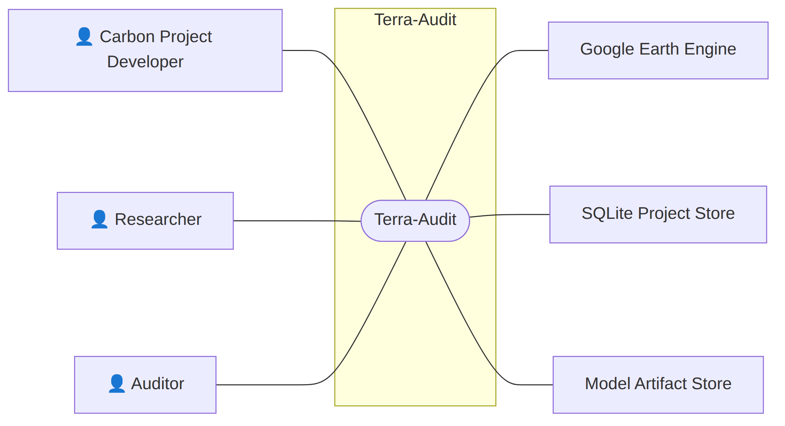

**Fig 1:** Terra-Audit — AI-Assisted Digital MRV Platform

### Level: 1

**USE CASE ID:** 1

**Name:** Terra-Audit

**Primary Actor:** Carbon Project Developer, Researcher, Auditor

**Secondary Actor:** Google Earth Engine, SQLite Project Store, Model Artifact Store

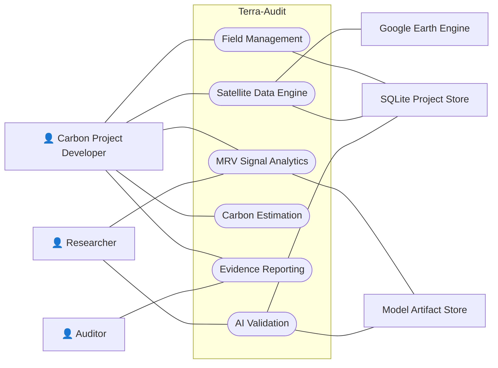

**Fig 2:** Level 1 of Terra-Audit

### Level: 1.1

**USE CASE ID:** 1.1

**Name:** Field Management

**Primary Actor:** Carbon Project Developer

**Secondary Actor:** SQLite Project Store

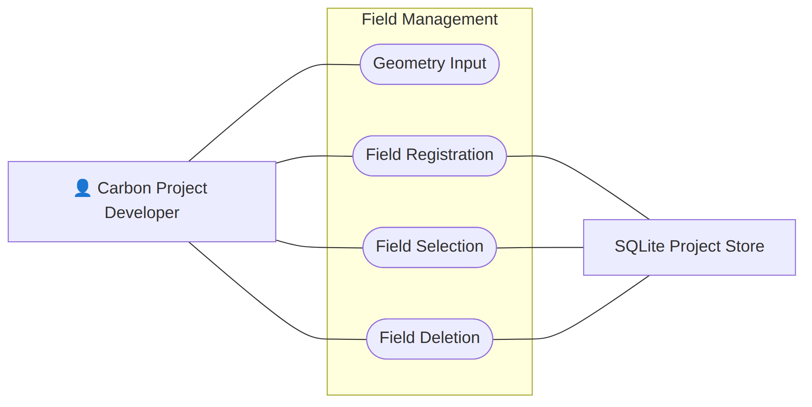

**Fig 3:** Field Management

### Level: 1.1.1

**USE CASE ID:** 1.1.1

**Name:** Geometry Input

**Primary Actor:** Carbon Project Developer

**Secondary Actor:** None

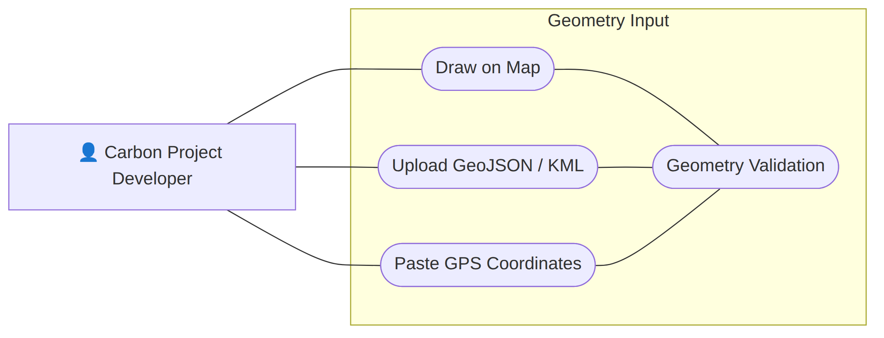

**Fig 4:** Geometry Input

### Level: 1.1.2

**USE CASE ID:** 1.1.2

**Name:** Field Registration

**Primary Actor:** Carbon Project Developer

**Secondary Actor:** SQLite Project Store

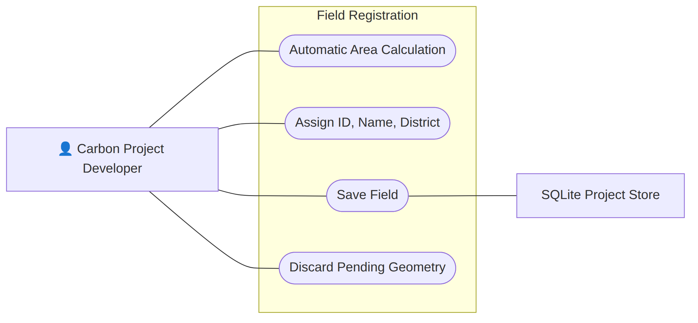

**Fig 5:** Field Registration

### Level: 1.2

**USE CASE ID:** 1.2

**Name:** Satellite Data Engine

**Primary Actor:** Carbon Project Developer

**Secondary Actor:** Google Earth Engine, SQLite Project Store

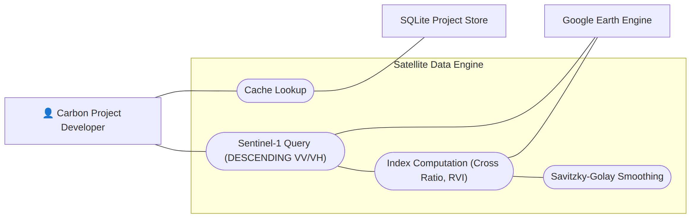

**Fig 6:** Satellite Data Engine

### Level: 1.3

**USE CASE ID:** 1.3

**Name:** MRV Signal Analytics

**Primary Actor:** Carbon Project Developer, Researcher

**Secondary Actor:** Model Artifact Store

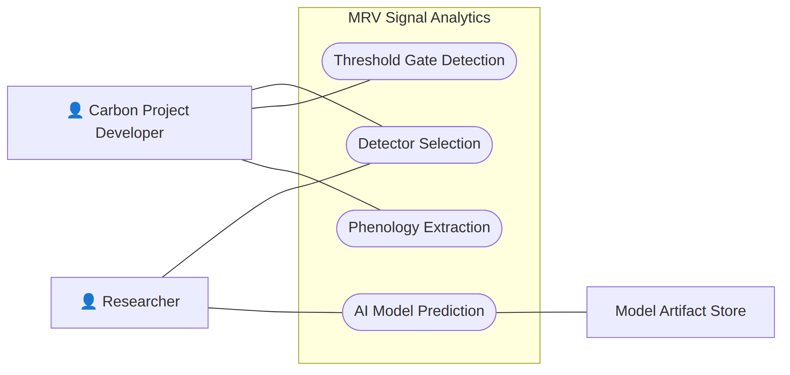

**Fig 7:** MRV Signal Analytics

### Level: 1.4

**USE CASE ID:** 1.4

**Name:** Carbon Estimation

**Primary Actor:** Carbon Project Developer

**Secondary Actor:** None

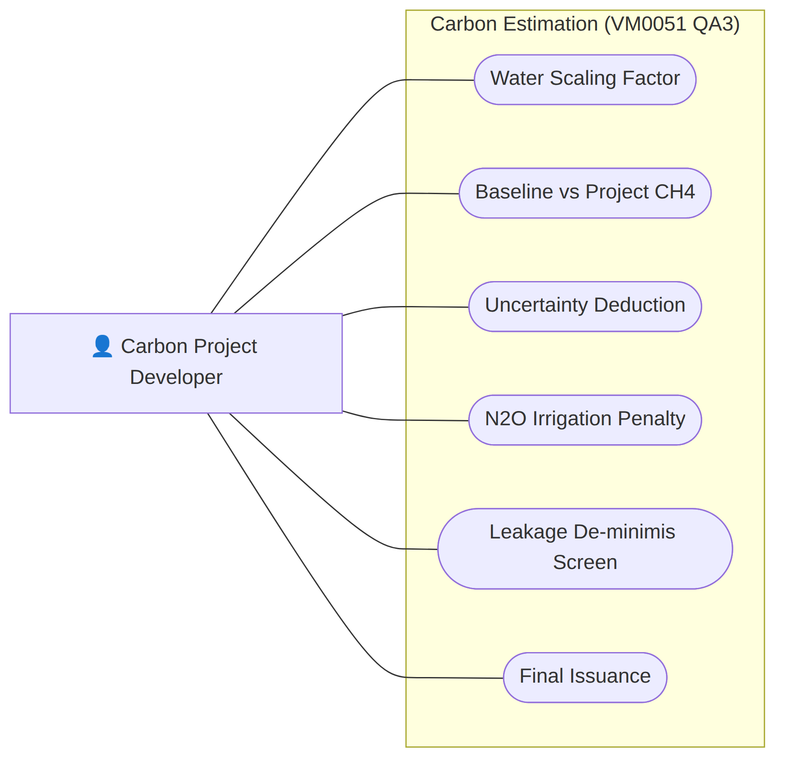

**Fig 8:** Carbon Estimation

### Level: 1.5

**USE CASE ID:** 1.5

**Name:** Evidence Reporting

**Primary Actor:** Carbon Project Developer, Auditor

**Secondary Actor:** None

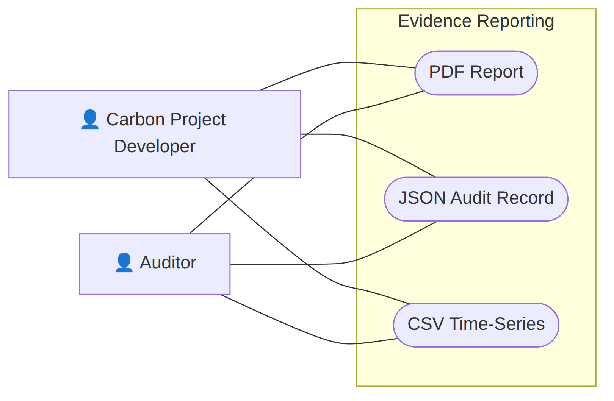

**Fig 9:** Evidence Reporting

### Level: 1.6

**USE CASE ID:** 1.6

**Name:** AI Validation

**Primary Actor:** Researcher

**Secondary Actor:** SQLite Project Store, Model Artifact Store

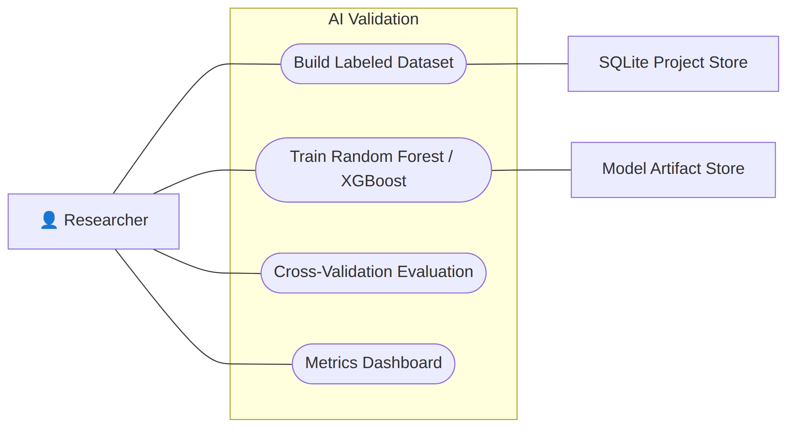

**Fig 10:** AI Validation

## 5.2 Activity Diagram

### Level: 1

**Name:** Terra-Audit

**Reference:** Use case Diagram level-1

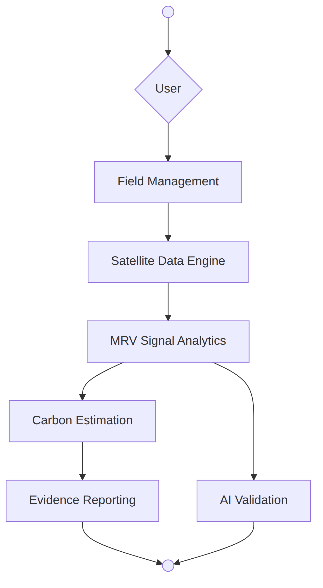

**Fig 11:** Terra-Audit (Use Case - 1)

### Level: 1.1

**Name:** Field Management

**Reference:** Use case Diagram level-1.1

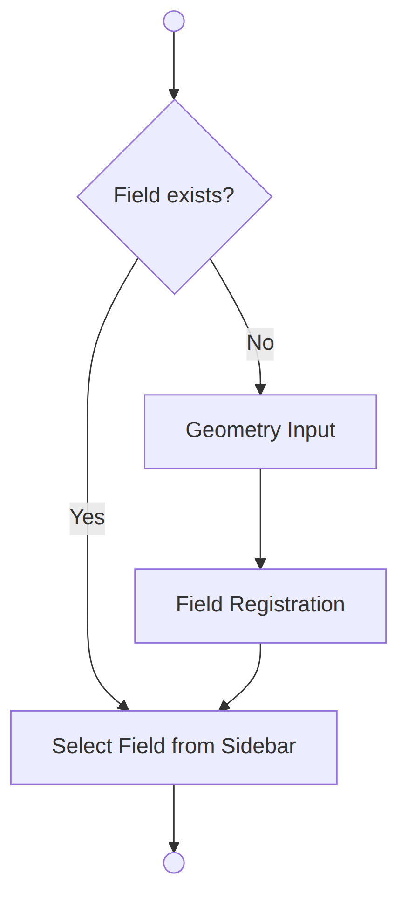

**Fig 12:** Field Management (Use Case - 1.1)

### Level: 1.1.1

**Name:** Geometry Input & Registration

**Reference:** Use case Diagram level-1.1.1, 1.1.2

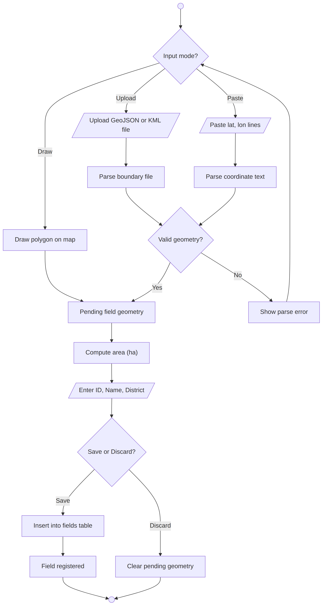

**Fig 13:** Geometry Input & Registration (Use Case - 1.1.1)

### Level: 1.2

**Name:** Satellite Data Engine

**Reference:** Use case Diagram level-1.2

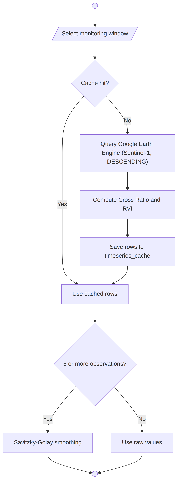

**Fig 14:** Satellite Data Engine (Use Case - 1.2)

### Level: 1.3

**Name:** MRV Signal Analytics

**Reference:** Use case Diagram level-1.3

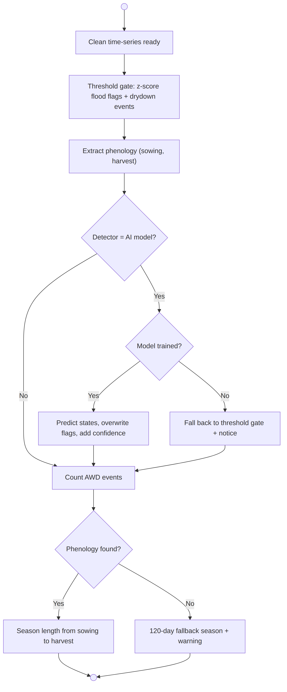

**Fig 15:** MRV Signal Analytics (Use Case - 1.3)

### Level: 1.4

**Name:** Carbon Estimation

**Reference:** Use case Diagram level-1.4

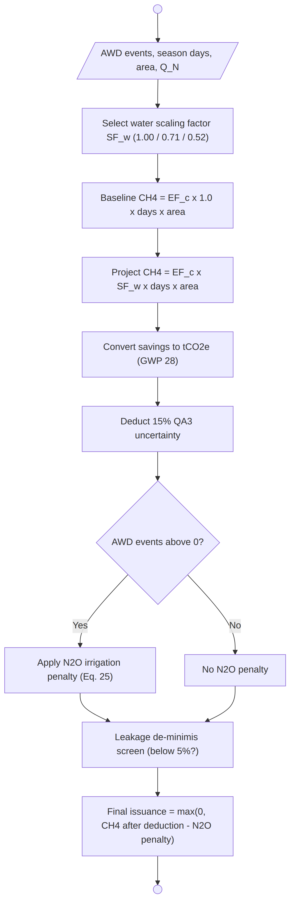

**Fig 16:** Carbon Estimation (Use Case - 1.4)

### Level: 1.5

**Name:** Evidence Reporting

**Reference:** Use case Diagram level-1.5

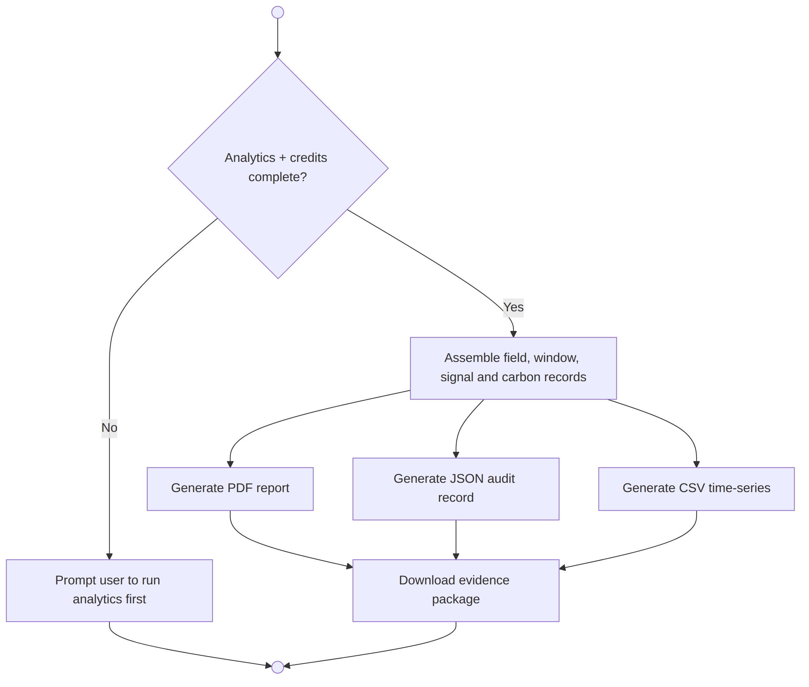

**Fig 17:** Evidence Reporting (Use Case - 1.5)

### Level: 1.6

**Name:** AI Validation

**Reference:** Use case Diagram level-1.6

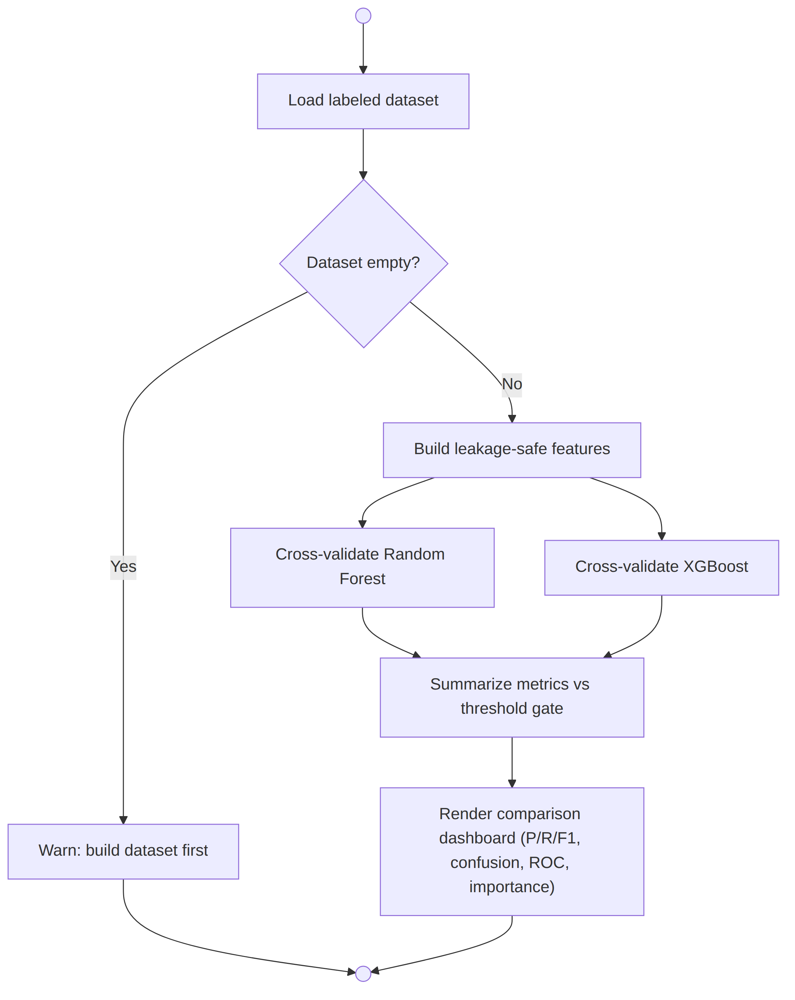

**Fig 18:** AI Validation (Use Case - 1.6)

---

# 6. Data Based Modeling

**DATA MODELING CONCEPT:** If software requirements include the necessity
to create, extend or interact with a database or complex data structures
need to be constructed and manipulated, then the software team chooses
to create data models as part of overall requirements modeling. The
entity relationship diagram (ERD) defines all data objects that are
processed within the system, the relationships between the data objects
and the information about how the data objects are entered, stored,
transformed and produced within the system.

**DATA OBJECTS:** A data object is a representation of composite
information that must be understood by the software. A data object can
be an external entity, a thing, an occurrence, a role, an organizational
unit, a place or a structure.

## 6.1 Noun Identification:

| Serial | Nouns | Problem/Solution space | Attributes |
|---|---|---|---|
| 1 | Field | S | 2, 3, 4, 5, 6 |
| 2 | Field ID | S | |
| 3 | Field name | S | |
| 4 | District | S | |
| 5 | Boundary geometry | S | |
| 6 | Area (hectares) | S | |
| 7 | Interactive map | P | |
| 8 | Rice paddy | P | |
| 9 | Farmer | P | |
| 10 | Monitoring window | S | 11, 12, 13 |
| 11 | Season preset | S | |
| 12 | Start date | S | |
| 13 | End date | S | |
| 14 | Satellite observation | S | 15, 16, 17, 18, 19 |
| 15 | Observation date | S | |
| 16 | VV backscatter | S | |
| 17 | VH backscatter | S | |
| 18 | Cross ratio | S | |
| 19 | Radar Vegetation Index (RVI) | S | |
| 20 | Time-series cache | S | 1, 10, 14 |
| 21 | Smoothing filter | S | |
| 22 | Z-score | S | |
| 23 | Flooded state | S | |
| 24 | Drydown event | S | |
| 25 | AWD event count | S | |
| 26 | Phenology | S | 27, 28, 29 |
| 27 | Sowing date | S | |
| 28 | Harvest date | S | |
| 29 | Season length | S | |
| 30 | Detector | S | |
| 31 | Threshold gate | S | 22, 23, 24 |
| 32 | AI model | S | 33, 34, 41 |
| 33 | Prediction (predicted label) | S | |
| 34 | Confidence | S | |
| 35 | Carbon estimate | S | 25, 29, 36, 37, 38, 39, 50 |
| 36 | Water scaling factor (SF_w) | S | |
| 37 | Emission factor (EF_c) | S | |
| 38 | Uncertainty deduction | S | |
| 39 | N₂O irrigation penalty | S | |
| 40 | Model artifact | S | |
| 41 | Dataset row | S | 14, 42 |
| 42 | Label (dry / flooded / drydown) | S | |
| 43 | Evidence package | S | 44, 45, 46 |
| 44 | PDF report | S | |
| 45 | JSON audit record | S | |
| 46 | CSV export | S | |
| 47 | Auditor | P | |
| 48 | Carbon registry (Verra) | P | |
| 49 | Leakage screen | S | |
| 50 | Final issuance | S | |

## 6.2 Final Data Objects:

1. Field
2. MonitoringWindow
3. TimeseriesObservation
4. AWDAnalysisResult
5. PhenologyResult
6. CarbonEstimate
7. AIDatasetRow
8. AIModelArtifact
9. EvidencePackage

## 6.3 Relations:

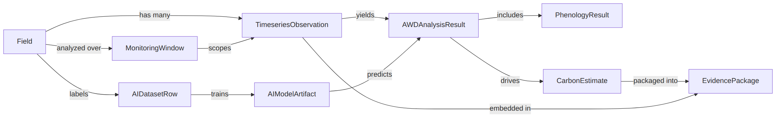

**Fig 19:** Entity Relation

## 6.4 ER DIAGRAM:

The persisted entities live in SQLite (`data/project_store.db`); model
artifacts are persisted as `joblib` files under `data/ai_models/`.
Analysis results, carbon estimates and evidence packages are derived
on demand and are not stored as tables.

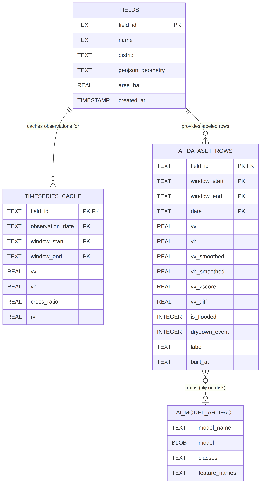

**Fig 20:** ER Diagram

## 6.5 Schema Diagram:

| Data Object | Attribute | Type |
|---|---|---|
| Field | field_id (PK) | string |
| | name | string |
| | district | string |
| | geojson_geometry | string (GeoJSON FeatureCollection) |
| | area_ha | number (hectares) |
| | created_at | timestamp |
| MonitoringWindow | season_label | string (e.g. "Boro 2026") |
| | window_start | date (ISO) |
| | window_end | date (ISO) |
| TimeseriesObservation | field_id (PK, FK) | string |
| | observation_date (PK) | date |
| | window_start (PK) | date |
| | window_end (PK) | date |
| | vv | number (dB) |
| | vh | number (dB) |
| | cross_ratio | number (VH − VV) |
| | rvi | number |
| AWDAnalysisResult | vv_smoothed | number |
| | vh_smoothed | number |
| | vv_zscore | number |
| | vv_diff | number |
| | is_flooded | 0 / 1 |
| | drydown_event | 0 / 1 |
| | predicted_label (AI path) | string |
| | confidence (AI path) | number (0–1) |
| | total_awd_events | integer |
| | detector_used | string |
| PhenologyResult | is_sowing | 0 / 1 |
| | is_harvest | 0 / 1 |
| | sowing_date | date |
| | harvest_date | date |
| | season_length_days | integer (120-day fallback) |
| | from_phenology | boolean |
| CarbonEstimate | sf_w_project | number (1.00 / 0.71 / 0.52) |
| | e_baseline | number (kg CH₄) |
| | e_project | number (kg CH₄) |
| | delta_e_ch4 | number (kg CH₄) |
| | delta_e_co2e | number (tCO₂e) |
| | unc_deduction_pct | number (0.15) |
| | unc_tco2e | number (tCO₂e) |
| | ch4_after_unc | number (tCO₂e) |
| | pe_n2o_tco2e | number (tCO₂e) |
| | q_n_kg_per_ha | number |
| | leakage_pct | number (%) |
| | leakage_de_minimis | boolean |
| | final_issuance | number (tCO₂e, floored at 0) |
| AIDatasetRow | field_id, window_start, window_end, date (PK) | composite key |
| | district | string |
| | area_ha | number |
| | vv | number |
| | vh | number |
| | cross_ratio | number |
| | rvi | number |
| | vv_smoothed | number |
| | vh_smoothed | number |
| | vv_zscore | number |
| | vv_diff | number |
| | vh_diff | number |
| | is_flooded | 0 / 1 |
| | drydown_event | 0 / 1 |
| | is_sowing | 0 / 1 |
| | is_harvest | 0 / 1 |
| | label | string ("dry" / "flooded" / "drydown") |
| | built_at | timestamp |
| AIModelArtifact | model_name | string ("random_forest" / "xgboost") |
| | model | fitted classifier (joblib) |
| | classes | list of strings |
| | feature_names | list of strings |
| EvidencePackage | pdf_report | bytes (A4, 8 sections) |
| | json_audit_record | string (all inputs + intermediates + full time-series) |
| | csv_timeseries | string |

---

# 7. Class Based Diagram

**Class-Based Modeling Concepts:**

Class-based modeling represents the objects that the system will
manipulate, the operations that will be applied to the objects,
relationships between the objects and the collaborations that occur
between the classes that are defined.

## 7.1 Identified Nouns:

| Serial | Noun |
|---|---|
| 1 | Field |
| 2 | Field ID |
| 3 | Field name |
| 4 | District |
| 5 | Boundary geometry |
| 6 | Area (hectares) |
| 7 | Interactive map |
| 8 | Monitoring window |
| 9 | Season preset |
| 10 | Start date |
| 11 | End date |
| 12 | Satellite observation |
| 13 | VV backscatter |
| 14 | VH backscatter |
| 15 | Cross ratio |
| 16 | Radar Vegetation Index (RVI) |
| 17 | Time-series cache |
| 18 | Smoothing filter |
| 19 | Z-score |
| 20 | Flooded state |
| 21 | Drydown event |
| 22 | AWD event count |
| 23 | Phenology |
| 24 | Sowing date |
| 25 | Harvest date |
| 26 | Season length |
| 27 | Detector |
| 28 | Threshold gate |
| 29 | AI model |
| 30 | Prediction (predicted label) |
| 31 | Confidence |
| 32 | Carbon estimate |
| 33 | Water scaling factor (SF_w) |
| 34 | Emission factor (EF_c) |
| 35 | Uncertainty deduction |
| 36 | N₂O irrigation penalty |
| 37 | Leakage screen |
| 38 | Final issuance |
| 39 | Model artifact |
| 40 | Dataset row |
| 41 | Label |
| 42 | Evidence package |
| 43 | PDF report |
| 44 | JSON audit record |
| 45 | CSV export |

## 7.2 Identified Verbs:

| Serial | Verbs |
|---|---|
| 1 | register |
| 2 | draw |
| 3 | upload |
| 4 | paste |
| 5 | parse |
| 6 | validate |
| 7 | compute |
| 8 | save |
| 9 | select |
| 10 | delete |
| 11 | query |
| 12 | filter |
| 13 | cache |
| 14 | smooth |
| 15 | standardize |
| 16 | detect |
| 17 | flag |
| 18 | count |
| 19 | extract |
| 20 | derive |
| 21 | fall back |
| 22 | calculate |
| 23 | scale |
| 24 | convert |
| 25 | deduct |
| 26 | penalize |
| 27 | screen |
| 28 | floor |
| 29 | issue |
| 30 | generate |
| 31 | export |
| 32 | download |
| 33 | build |
| 34 | label |
| 35 | train |
| 36 | cross-validate |
| 37 | persist |
| 38 | load |
| 39 | predict |
| 40 | overwrite |
| 41 | evaluate |
| 42 | summarize |
| 43 | visualize |

## 7.3 General Classification:

Candidate classes are categorized based on the seven general
classification. The analysis classes manifest themselves in one of the
following ways:

1. External entities
2. Things
3. Events
4. Roles
5. Organizational units
6. Places
7. Structures

A candidate class is selected for special classification if it fulfills
two or more characteristics.

| Serial | Solution Space Nouns | General Classifications |
|---|---|---|
| 1 | Field | 2, 6, 7 (selected) |
| 2 | Boundary geometry | 2 |
| 3 | Area (hectares) | 2 |
| 4 | Monitoring window | 2, 7 (selected) |
| 5 | Satellite observation | 2, 3, 7 (selected) |
| 6 | VV backscatter | 2 |
| 7 | VH backscatter | 2 |
| 8 | Cross ratio | 2 |
| 9 | RVI | 2 |
| 10 | Time-series cache | 2, 7 (selected) |
| 11 | Smoothing filter | 2 |
| 12 | Z-score | 2 |
| 13 | Flooded state | 3 |
| 14 | Drydown event | 3 |
| 15 | AWD event count | 2 |
| 16 | Phenology | 2, 3 (selected) |
| 17 | Sowing date | 3 |
| 18 | Harvest date | 3 |
| 19 | Detector | 4 |
| 20 | Threshold gate | 2, 7 (selected) |
| 21 | AI model | 2, 7 (selected) |
| 22 | Prediction | 3 |
| 23 | Confidence | 2 |
| 24 | Carbon estimate | 2, 7 (selected) |
| 25 | Water scaling factor | 2 |
| 26 | Uncertainty deduction | 2, 3 |
| 27 | N₂O irrigation penalty | 2, 3 |
| 28 | Final issuance | 2, 3 |
| 29 | Model artifact | 2, 7 (selected) |
| 30 | Dataset row | 2, 7 (selected) |
| 31 | Label | 2 |
| 32 | Evidence package | 2, 7 (selected) |
| 33 | PDF report | 2 |
| 34 | JSON audit record | 2 |
| 35 | CSV export | 2 |
| 36 | Google Earth Engine | 1 |
| 37 | SQLite project store | 1, 6 |
| 38 | Interactive map | 2, 6 |

## 7.4 Selection Criteria:

The candidate classes are then selected as classes by six Selection
Criteria. A candidate class generally becomes a class when it fulfills
around three characteristics.

1. Retain information
2. Needed services
3. Multiple attributes
4. Common attributes
5. Common operations
6. Essential requirements

Potential general classified nouns to become a class after selection
criteria:

| Serial | Solution Space Nouns | Selection Criteria |
|---|---|---|
| 1 | **Field** | 1–5 (selected) |
| 2 | TimeseriesObservation | 1–5 (selected) |
| 3 | MonitoringWindow | 1, 3, 4 (selected) |
| 4 | CarbonEstimate | 1–5 (selected) |
| 5 | AIDatasetRow | 1–5 (selected) |
| 6 | AIModelArtifact | 1–5 (selected) |
| 7 | EvidencePackage | 1, 2, 3 (selected) |

Additional classes required:

| Serial | Additional classes |
|---|---|
| 1 | SpatialDataEngine |
| 2 | AdaptiveAWDGate |
| 3 | CarbonAssetEngine |
| 4 | GeoUtils |
| 5 | ProjectStore |
| 6 | ReportGenerator |
| 7 | DatasetBuilder |
| 8 | FeatureEngineer |
| 9 | ModelRegistry |
| 10 | AWDPredictor |
| 11 | ModelEvaluator |

## 7.5 Class Card:

### SpatialDataEngine

| Attribute | Method |
|---|---|
| (reads `EE_PROJECT` from environment) | +extract_clean_timeseries(geojson_geometry, start_date, end_date) |

| Responsibilities | Collaborator |
|---|---|
| Initialize the Earth Engine session; Fetch Sentinel-1 VV/VH backscatter (DESCENDING pass only); Compute Cross Ratio and RVI per observation; Apply Savitzky-Golay smoothing (window 5, polyorder 2) | Google Earth Engine |

### AdaptiveAWDGate

| Attribute | Method |
|---|---|
| −z_flood_threshold = −0.8; −dynamic_delta_sigma = 1.2 | +analyze_irrigation_behavior(df); +extract_phenology(df) |

| Responsibilities | Collaborator |
|---|---|
| Standardize VV into z-scores and flag flooded states; Detect AWD drydown events (sharp VV jump after flooding); Derive sowing (VH minimum) and harvest (sharpest post-peak VH drop) | SpatialDataEngine (input), DatasetBuilder, Streamlit UI |

### CarbonAssetEngine

| Attribute | Method |
|---|---|
| −ef_c = 1.4; −gwp_ch4 = 28; SF_CONTINUOUS_FLOODING = 1.00; SF_SINGLE_AERATION = 0.71; SF_TRUE_AWD = 0.52; UNC_QA3_DEFAULT = 0.15; CF_N2O = 0.00314; GWP_N2O = 265 | +calculate_credits(awd_events, season_length_days, area_ha, q_n_kg_per_ha); −_water_scaling_factor(awd_events); −_n2o_irrigation_penalty(q_n_kg_per_ha, area_ha) |

| Responsibilities | Collaborator |
|---|---|
| Implement the VM0051 v1.0 QA3 credit calculation; Baseline vs project CH₄, CO₂e conversion, uncertainty deduction; N₂O penalty, leakage screen, final issuance floored at 0 | Streamlit UI, ReportGenerator (output shape) |

### GeoUtils

| Attribute | Method |
|---|---|
| — | +compute_area_ha(geojson_feature); +parse_geojson_upload(content); +parse_kml_upload(content); +parse_coordinate_text(text) |

| Responsibilities | Collaborator |
|---|---|
| Parse user-supplied boundaries (GeoJSON / KML / coordinate text); Return (feature, error) instead of raising on bad input; Compute area via Shoelace formula with spherical correction | Streamlit UI |

### ProjectStore

| Attribute | Method |
|---|---|
| −DB_PATH = data/project_store.db | +get_db_connection(); +initialize_database(); +check_cache(field_id, window_start, window_end); +save_cache(field_id, df, window_start, window_end) |

| Responsibilities | Collaborator |
|---|---|
| Own the SQLite schema (fields, timeseries_cache) and migrations; Serve cached time-series before any live GEE query; Persist newly fetched observations | Streamlit UI, DatasetBuilder |

### ReportGenerator

| Attribute | Method |
|---|---|
| −_PDF (A4 template with header/footer) | +generate_pdf(field_info, window, signal, carbon); +generate_audit_json(field_info, window, signal, carbon, df); +generate_timeseries_csv(df) |

| Responsibilities | Collaborator |
|---|---|
| Produce the 8-section auditor-facing PDF report; Emit the machine-readable JSON audit record with full time-series; Emit the raw CSV export | CarbonAssetEngine (input shape), Streamlit UI |

### DatasetBuilder

| Attribute | Method |
|---|---|
| −DATASET_TABLE = "ai_dataset_rows" | +build_dataset(gate); +save_dataset(df); +load_dataset() |

| Responsibilities | Collaborator |
|---|---|
| Replay the threshold gate over every cached field-window series; Label each observation dry / flooded / drydown; Persist and reload the labeled dataset | AdaptiveAWDGate, ProjectStore |

### FeatureEngineer

| Attribute | Method |
|---|---|
| −LABEL_CLASSES = [dry, flooded, drydown]; −base features: vv, vh, cross_ratio, rvi, vv_smoothed, vh_smoothed, vv_diff | +build_features(df, include_area_ha); +encode_labels(y) |

| Responsibilities | Collaborator |
|---|---|
| Build leakage-safe feature matrix (excludes the gate's own flags); Add days-since-window-start / days-since-sowing and district one-hots; Encode labels in a fixed class order | ModelRegistry, AWDPredictor |

### ModelRegistry

| Attribute | Method |
|---|---|
| −MODEL_DIR = data/ai_models; −MODEL_REGISTRY: random_forest (200 trees, balanced), xgboost (200 rounds, depth 4) | +train_and_evaluate(model_name, X, y, k); +save_model(result); +load_model(model_name) |

| Responsibilities | Collaborator |
|---|---|
| Train classifiers with stratified k-fold cross-validation (plain k-fold fallback for tiny classes); Persist and reload model bundles via joblib | FeatureEngineer, AWDPredictor, ModelEvaluator |

### AWDPredictor

| Attribute | Method |
|---|---|
| — | +predict_awd_states(df, model_name, field_id, district, area_ha, window_start, window_end) |

| Responsibilities | Collaborator |
|---|---|
| Load the selected model and align features to its training columns; Overwrite is_flooded / drydown_event with model output; Attach predicted_label and confidence; raise FileNotFoundError if untrained (UI falls back to the gate) | ModelRegistry, FeatureEngineer, Streamlit UI |

### ModelEvaluator

| Attribute | Method |
|---|---|
| — | +summarize_fold_predictions(result); +feature_importance(result); +roc_curve_data(result); +summarize(result) |

| Responsibilities | Collaborator |
|---|---|
| Compute per-class precision / recall / F1 and confusion matrix from out-of-fold predictions; Report threshold-agreement score (explicitly not ground-truth accuracy); Provide feature importance and one-vs-rest ROC data | ModelRegistry, Streamlit UI |

## 7.8 CRC Diagram:

**Diagram Id: 1**

**Name: Carbon Project Developer**

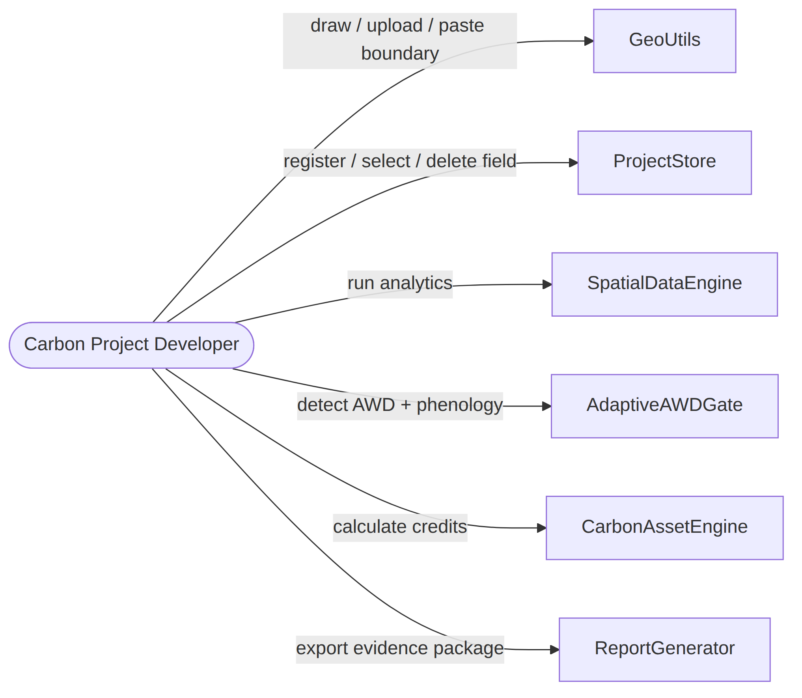

**Fig 21:** CRC (Carbon Project Developer)

**Diagram Id: 2**

**Name: Researcher**

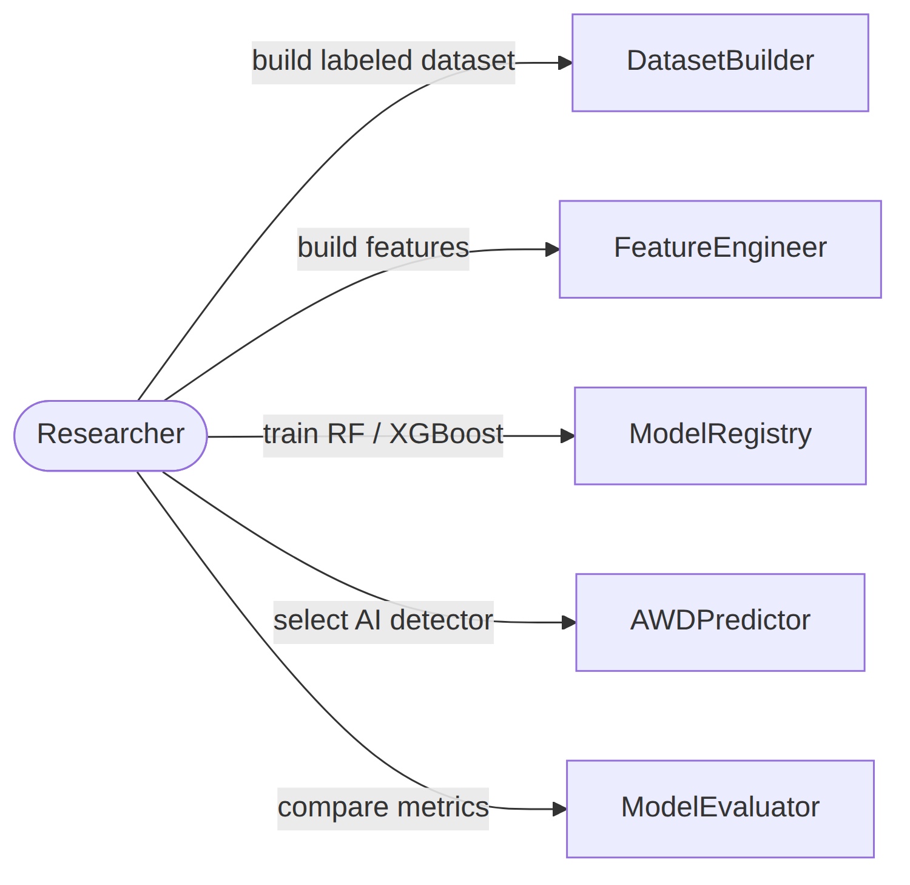

**Fig 22:** CRC (Researcher)

---

# 8. Behavioral Diagram

## 8.1 Event Table:

| Serial | Event | Initiator | Associated Methods |
|---|---|---|---|
| 1 | Draw field boundary | Carbon Project Developer | (Leaflet Draw → pending geometry) |
| 2 | Upload boundary file | Carbon Project Developer | +parse_geojson_upload(); +parse_kml_upload() |
| 3 | Paste GPS coordinates | Carbon Project Developer | +parse_coordinate_text() |
| 4 | Register field | Carbon Project Developer | +compute_area_ha(); INSERT INTO fields |
| 5 | Delete field | Carbon Project Developer | DELETE FROM fields, timeseries_cache |
| 6 | Run analytics | Carbon Project Developer | +check_cache(); +extract_clean_timeseries(); +save_cache() |
| 7 | Detect AWD events | System | +analyze_irrigation_behavior() |
| 8 | Extract phenology | System | +extract_phenology() |
| 9 | AI prediction | Researcher / Developer | +predict_awd_states(); +load_model() |
| 10 | Model fallback (untrained) | System | FileNotFoundError → threshold gate |
| 11 | Calculate carbon credits | Carbon Project Developer | +calculate_credits() |
| 12 | Export evidence package | Carbon Project Developer / Auditor | +generate_pdf(); +generate_audit_json(); +generate_timeseries_csv() |
| 13 | Build labeled dataset | Researcher | +build_dataset(); +save_dataset() |
| 14 | Train AI models | Researcher | +build_features(); +train_and_evaluate(); +save_model() |
| 15 | Evaluate AI models | Researcher | +summarize_fold_predictions(); +feature_importance(); +roc_curve_data() |

## 8.2 State Transition Diagram

A UML state diagram, which depicts the active states for each class and
the occasions (triggers) that induce changes between these active
states, is part of a behavioral model. Here we've listed the most
important events that trigger the change of states.

**Diagram ID: 1**

**Class Name: Field**

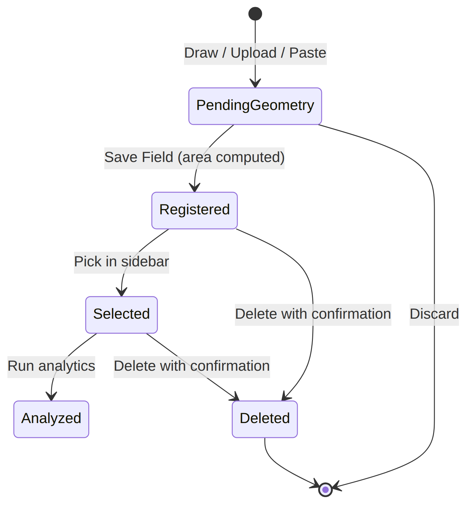

**Fig 23:** Field State Transition

**Diagram ID: 2**

**Class Name: ProjectStore (Time-series Cache)**

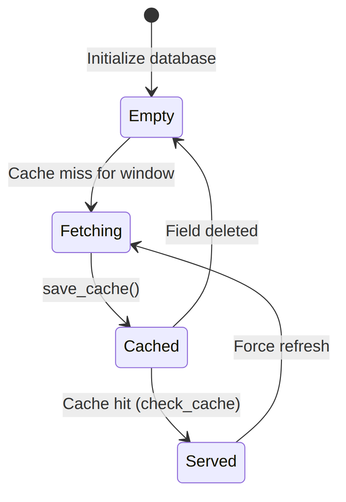

**Fig 24:** ProjectStore State Transition

**Diagram ID: 3**

**Class Name: AdaptiveAWDGate (per observation)**

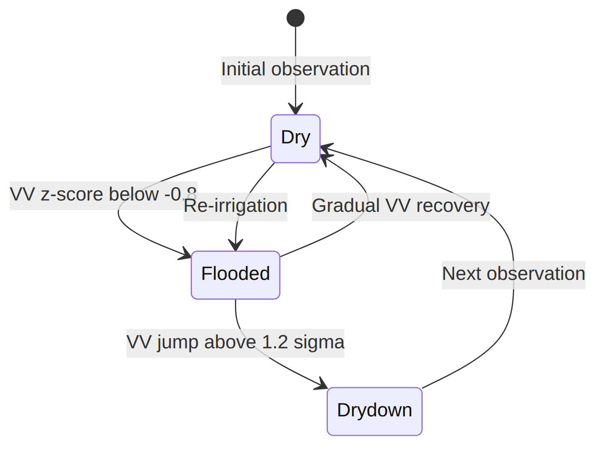

**Fig 25:** AdaptiveAWDGate State Transition

**Diagram ID: 4**

**Class Name: AIModelArtifact**

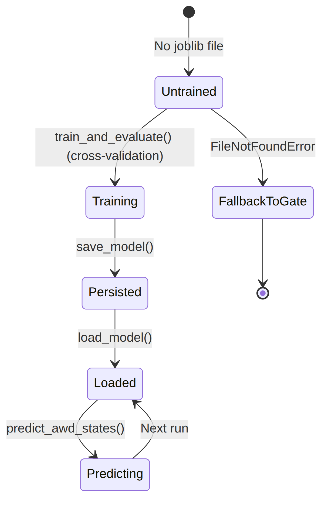

**Fig 26:** AIModelArtifact State Transition

**Diagram ID: 5**

**Class Name: CarbonEstimate**

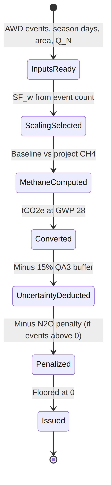

**Fig 27:** CarbonEstimate State Transition

**Diagram ID: 6**

**Class Name: EvidencePackage**

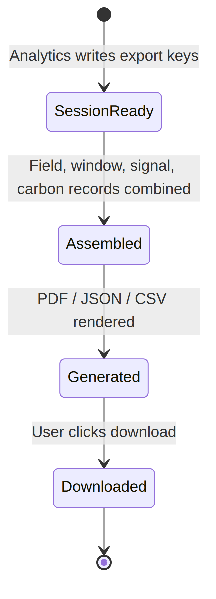

**Fig 28:** EvidencePackage State Transition

## 8.3 Sequence Diagram

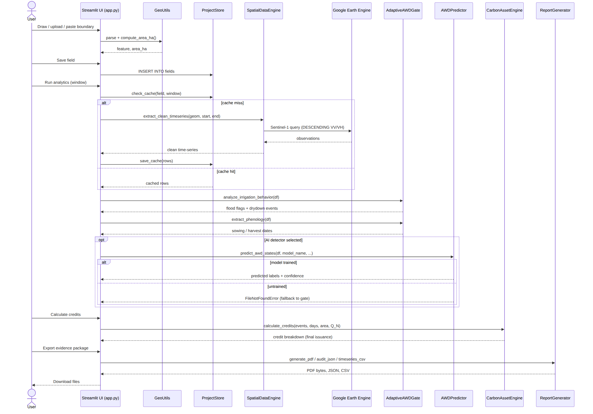

**Fig 29:** Sequence Diagram

---

# 9. Data Flow Diagram

A data-flow diagram is a visual representation of how data moves through
a system or a process. A data flow diagram (DFD) shows how information
moves through any system or process. It displays data inputs, outputs,
storage locations, and routes between each destination using predefined
symbols such as rectangles, circles, and arrows as well as brief text
labels.

## 9.1 Level 0: Terra-Audit

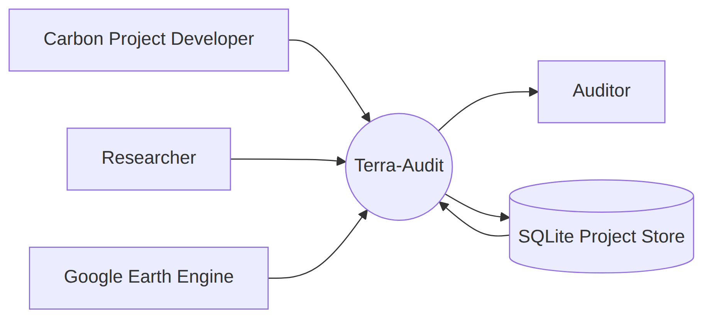

**Fig 30:** Data Flow Diagram (Level 0)

## 9.2 Level 1: Terra-Audit

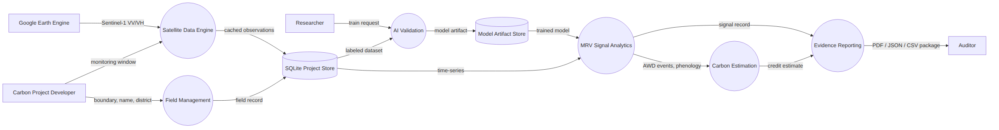

**Fig 31:** Data Flow Diagram (Level 1)

---

# 10. References

1. Verra, *VM0051 v1.0 — Methodology for Improved Management in Rice
   Production Systems*, 27 February 2025. Available at:
   https://verra.org/methodologies/ — a copy is included in this
   repository at `docs/VM0051v1_27Feb25.pdf`.
2. IPCC, *2019 Refinement to the 2006 IPCC Guidelines for National
   Greenhouse Gas Inventories*, Volume 4 (Agriculture, Forestry and
   Other Land Use), Chapter 5, Table 5.12 (water regime scaling
   factors) and Chapter 11, Table 11.1 (N₂O emission factors).
   https://www.ipcc-nggip.iges.or.jp/public/2019rf/
3. IPCC, *Fifth Assessment Report (AR5), Climate Change 2013: The
   Physical Science Basis* — 100-year Global Warming Potential values
   (CH₄ = 28, N₂O = 265) used in the carbon estimation engine.
4. European Space Agency / Copernicus Programme, *Sentinel-1 SAR User
   Guide*. https://sentinels.copernicus.eu/web/sentinel/user-guides/sentinel-1-sar
5. Google, *Google Earth Engine API Documentation* (`earthengine-api`,
   dataset `COPERNICUS/S1_GRD`). https://developers.google.com/earth-engine
6. R. Lampayan et al., "Adoption and economics of alternate wetting and
   drying water management for irrigated lowland rice," *Field Crops
   Research*, vol. 170, pp. 95–108, 2015 (background on AWD practice).
7. A. Savitzky and M. J. E. Golay, "Smoothing and Differentiation of
   Data by Simplified Least Squares Procedures," *Analytical
   Chemistry*, vol. 36, no. 8, pp. 1627–1639, 1964 (signal smoothing
   filter used in the data engine).
8. L. Breiman, "Random Forests," *Machine Learning*, vol. 45, no. 1,
   pp. 5–32, 2001.
9. T. Chen and C. Guestrin, "XGBoost: A Scalable Tree Boosting System,"
   *Proceedings of the 22nd ACM SIGKDD*, pp. 785–794, 2016.
10. F. Pedregosa et al., "Scikit-learn: Machine Learning in Python,"
    *Journal of Machine Learning Research*, vol. 12, pp. 2825–2830, 2011.
11. Streamlit Inc., *Streamlit Documentation*. https://docs.streamlit.io
12. R. S. Pressman and B. R. Maxim, *Software Engineering: A
    Practitioner's Approach*, 8th ed., McGraw-Hill, 2015 (requirements
    modeling: scenario-based, data-based, class-based and behavioral
    modeling used throughout this document).
