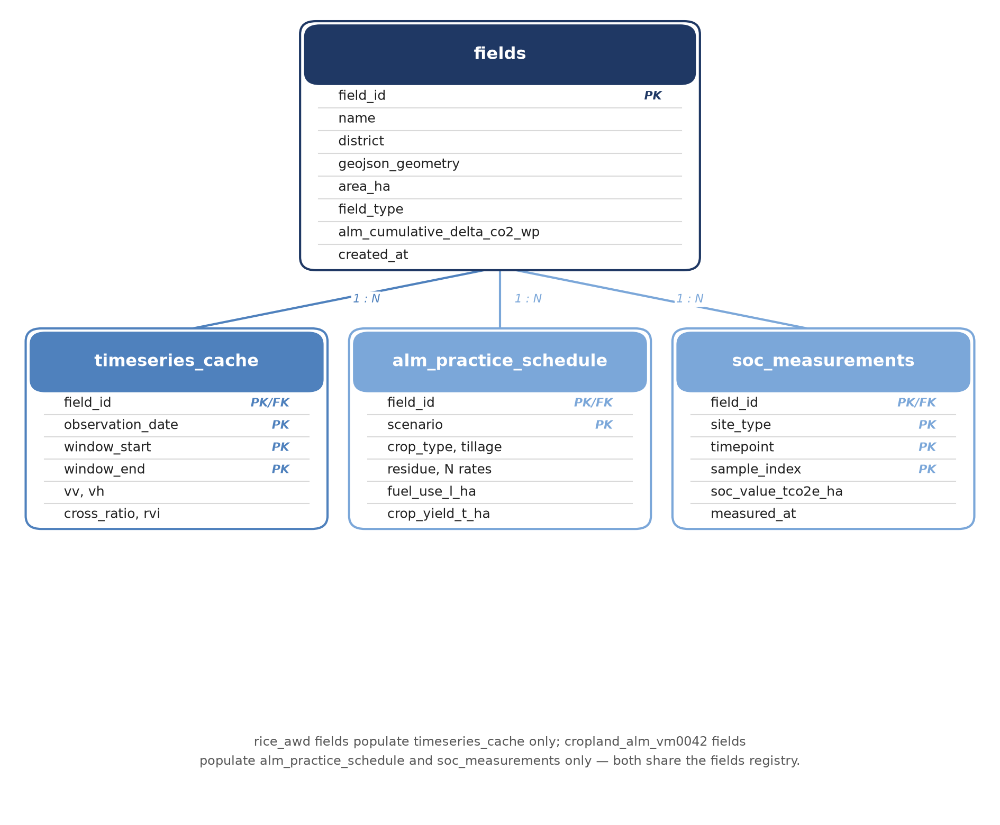
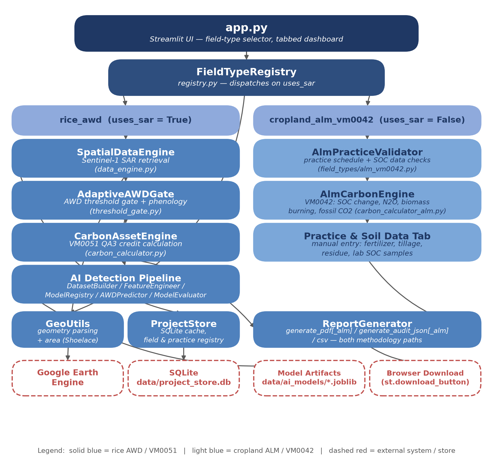
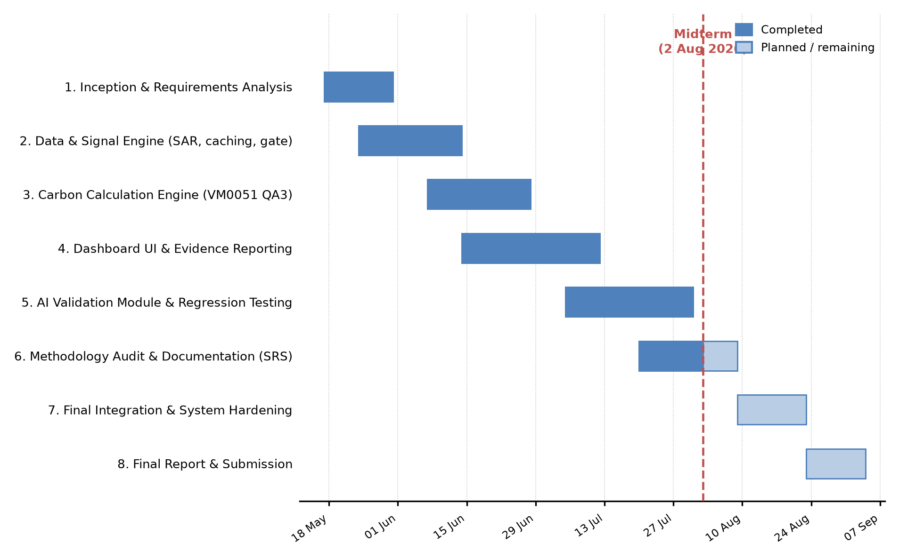

| {width=0.7in} | [INSTITUTE OF INFORMATION TECHNOLOGY]{custom-style="CoverRedHeader"}\
UNIVERSITY OF DHAKA | {width=1.1in} |
|:---:|:---:|:---:|

::: {custom-style="CoverRule"}

:::

::: {custom-style="CoverCenter"}
&#160;\
&#160;\
[TERRA-AUDIT]{custom-style="CoverTitleBlue"}

[– AI-Assisted Digital MRV Platform for AWD Rice Irrigation and Agricultural Land Management Carbon Credits]{custom-style="CoverSubtitleItalic"}
&#160;\
&#160;
:::

::: {custom-style="CoverCenter"}
[Submitted As]{custom-style="CoverRedHeader"}\
**Technical Report**\
SE801 Project Midterm Report
&#160;\
&#160;
:::

::: {custom-style="CoverCenter"}
[Submitted By]{custom-style="CoverRedHeader"}\
**Kazi Nahid**\
BSSE Roll: 1437\
**Md. Jariful Rahman**\
BSSE Roll: 1419
&#160;\
&#160;
:::

::: {custom-style="CoverCenter"}
[Supervised By]{custom-style="CoverRedHeader"}\
**Dr. Mohammed Shafiul Alam Khan**\
Professor\
Institute of Information Technology\
University of Dhaka
&#160;\
&#160;
:::

::: {custom-style="CoverRule"}

:::

::: {custom-style="CoverCenter"}
[Date of Submission]{custom-style="CoverRedHeader"}\
2 August 2026
:::

# Table of Contents

- [1. Project Overview](#1-project-overview)
- [2. Requirements Analysis](#2-requirements-analysis)
- [3. System Modeling](#3-system-modeling)
- [4. Data & Information Modeling](#4-data--information-modeling)
- [5. Software Design](#5-software-design)
- [6. AI Engineering Design](#6-ai-engineering-design)
- [7. Preliminary Test Plan](#7-preliminary-test-plan)
- [8. Timeline](#8-timeline)
- [References](#references)

# 1. Project Overview

## 1.1 Project Title

**Terra-Audit — AI-Assisted Digital MRV Platform for AWD Rice Irrigation and Agricultural Land Management Carbon Credits.**

## 1.2 Problem Statement

Rice paddies are a major source of anthropogenic methane, and Alternate
Wetting and Drying (AWD) irrigation is a proven mitigation practice, but
existing carbon-credit workflows fail to verify it credibly. Self-reported
irrigation logs are unverifiable, on-the-ground water-level loggers are too
expensive to deploy across thousands of smallholder paddies, and carbon
calculations are usually opaque spreadsheets that an auditor cannot trace
back to raw evidence. A parallel problem exists for non-wetland cropland
enrolled under improved agricultural land management: baseline versus
project practice changes (fertilizer, tillage, residue, crop planting) and
soil organic carbon (SOC) stock change must be quantified from lab
measurements and disclosed with full uncertainty accounting, which existing
smallholder-scale tooling does not support end to end.

Terra-Audit addresses both gaps with a single low-cost, evidence-first
platform: Sentinel-1 SAR observations pulled from Google Earth Engine
detect AWD drydown events for rice fields, while manually entered practice
schedules and SOC lab samples drive a parallel accounting path for
cropland fields, and both paths are converted into auditor-ready evidence
packages under Verra methodologies.

## 1.3 Objectives

- Replace unverifiable farmer self-reporting with satellite-derived AWD
  event detection for rice paddies, using freely available Sentinel-1 SAR
  data that works day and night through cloud cover.
- Provide a parallel, methodology-compliant accounting path for cropland
  fields enrolled under improved agricultural land management, driven by
  manually entered practice and SOC data rather than satellite signal.
- Implement carbon credit calculation transparently against Verra
  **VM0051** (rice AWD, QA3 default-factor pathway) and Verra **VM0042**
  (cropland ALM) so every intermediate value is inspectable and
  reproducible by hand.
- Offer an optional AI-assisted detector (Random Forest / XGBoost) that
  can replace the rule-based AWD gate, with automatic fallback when no
  model has been trained.
- Package every credit calculation into a self-contained, downloadable
  evidence bundle (PDF, JSON, CSV) that a third-party auditor can verify
  without access to the running system.

## 1.4 Scope

**In scope:**

- Field boundary registration by drawing, file upload (GeoJSON/KML), or
  pasted GPS coordinates, with automatic area computation.
- A field-type selector that routes each registered field down one of two
  independent methodology paths — `rice_awd` (Sentinel-1 driven) or
  `cropland_alm_vm0042` (manual practice/SOC driven).
- Sentinel-1 retrieval, caching, signal smoothing, threshold-gate AWD
  detection, and phenology extraction for rice fields.
- Manual practice-schedule and SOC-measurement entry, validation, and
  VM0042 credit calculation for cropland fields (SOC stock change, N₂O,
  biomass burning, fossil-fuel CO₂, uncertainty and buffer deduction).
- VM0051 QA3 credit calculation for rice fields (CH₄ water-scaling
  accounting, uncertainty deduction, N₂O irrigation penalty).
- AI-assisted AWD detection and a model validation dashboard, scoped to
  the rice path only.
- Evidence package export (PDF, JSON, CSV) for both methodology paths.
- Primary geographic focus is Bangladesh and South Asia for the rice
  path; the cropland ALM path is not geography-locked but uses the same
  IPCC/AR5 default emission factors.

**Out of scope (this phase):**

- On-the-ground hardware sensors of any kind.
- Verra methodologies other than VM0051 and VM0042.
- Leakage accounting for the cropland ALM path — the engine knowingly
  reports this gap as disclosed (`leakage_screened=False`) rather than
  silently assuming zero, pending a future methodology pass.
- Multi-node deployment, authentication/authorization, or hosted
  persistence beyond the local SQLite store.

## 1.5 Deliverables

- A working Streamlit dashboard (`app.py`) covering field management,
  signal analytics, both carbon ledgers, and AI validation.
- A local SQLite-backed field registry, time-series cache, and ALM
  practice/SOC data store (`src/database.py`).
- Two independent, unit-tested carbon accounting engines:
  `CarbonAssetEngine` (VM0051 QA3) and `AlmCarbonEngine` (VM0042).
- An AI detection pipeline (dataset builder, feature engineer, model
  registry, predictor, evaluator) for the rice path.
- Exportable evidence packages (PDF / JSON / CSV) for both methodology
  paths.
- This technical documentation and an automated `pytest` regression suite
  covering both accounting engines.

# 2. Requirements Analysis

## 2.1 Functional Requirements (List)

| ID | Requirement | Priority |
|---|---|---|
| FR1 | Register a field by drawing a polygon, uploading a GeoJSON/KML file, or pasting `lat, lon` coordinates; compute area automatically via the Shoelace formula with spherical correction. | Must |
| FR2 | Select a field type (`rice_awd` or `cropland_alm_vm0042`) at registration; the `FieldTypeRegistry` dispatches the correct detector, methodology engine, and UI tabs for that field thereafter. | Must |
| FR3 | For rice fields, retrieve Sentinel-1 VV/VH backscatter (DESCENDING pass only) over the field geometry and cache it in SQLite keyed by field and monitoring window. | Must |
| FR4 | Apply Savitzky-Golay smoothing, z-score flood detection (z < −0.8), and drydown-event detection (>1.2σ jump after a flooded state) to the rice time-series. | Must |
| FR5 | Derive sowing and harvest dates from the VH phenology signal, falling back to a 120-day season with a visible warning when signal quality is insufficient. | Must |
| FR6 | For cropland fields, accept manually entered baseline/project practice schedules (crop type, tillage, residue handling, fertilizer rates, fuel use, yield) and lab-measured SOC samples, validating completeness before calculation. | Must |
| FR7 | Calculate rice carbon credits under VM0051 QA3: baseline vs. project CH₄, IPCC water-scaling factor, 15% uncertainty deduction, N₂O irrigation penalty, final issuance floored at zero. | Must |
| FR8 | Calculate cropland carbon credits under VM0042: SOC stock change (Quantification Approach 2), default-factor N₂O (fertilizer + N-fixing residue), biomass burning, fossil-fuel CO₂, probability-of-exceedance uncertainty deduction, cumulative non-permanence buffer. | Must |
| FR9 | Offer an AI-assisted AWD detector (Random Forest or XGBoost) as an optional override for the rice path, with automatic fallback to the rule-based gate if the selected model is untrained. | Should |
| FR10 | Provide an AI validation dashboard comparing detector agreement, precision/recall/F1, confusion matrices, feature importance, and ROC curves. | Should |
| FR11 | Export a complete evidence package — PDF report, JSON audit record, and CSV — for whichever methodology path a field uses. | Must |
| FR12 | Allow field selection and deletion from a sidebar registry, cascading deletion to cached time-series and stored practice/SOC data. | Should |

## 2.2 Non-functional Requirements

| Category | Requirement |
|---|---|
| Reliability | Boundary parsers never raise on malformed input; they return `(data, error)` so the UI can surface a readable message. Database migrations are idempotent and safe to re-run. |
| Accuracy & Traceability | Every reported carbon figure must be reconstructable by hand from disclosed intermediate values; no hidden constants or silent defaults. |
| Performance | Cache-first design — a repeat analytics run for an already-fetched field/window returns instantly from SQLite rather than re-querying Earth Engine. |
| Usability | Single-page tabbed dashboard; values computed in one tab (AWD events, season length, area) auto-populate the corresponding carbon ledger tab. |
| Portability | Runs on a single machine via `streamlit run app.py`; requires one-time Earth Engine authentication per machine, no other external services. |
| Maintainability | Each field type's detector and methodology engine are isolated behind a small `register_field_type()` plugin registry, so a third field type can be added without touching the two existing paths. |
| Data Integrity | SAR retrieval restricted to DESCENDING passes only to avoid orbit-mixing artifacts; known methodology gaps (e.g., ALM leakage) are surfaced as explicit flags rather than defaulted to zero. |
| Testability | Both accounting engines are covered by an automated `pytest` regression suite, including golden-value and fallback-path scenarios. |

## 2.3 Stakeholders

| Stakeholder | Interest |
|---|---|
| Carbon Project Developer | Registers fields, runs analytics or enters practice/SOC data, and generates credit estimates and evidence packages. |
| Researcher / Data Scientist | Builds AI training datasets, trains and validates AWD detection models, studies detector agreement with the rule-based gate. |
| Auditor | Receives the exported evidence package and independently reconstructs every reported number from its disclosed inputs. |
| Program Operator (farmer cooperative / NGO) | Enrolls farmers' fields into the program and relies on the platform's outputs to claim credits on the farmers' behalf. |

# 3. System Modeling

## 3.1 Use Case Diagram and Descriptions

A use case describes the system's behavior under a given condition as it
responds to a request from one of its actors. **Primary actors** interact
directly with Terra-Audit to achieve a goal: the **Carbon Project
Developer**, the **Researcher**, and the **Auditor**. **Secondary actors**
support the system so primary actors can do their work: **Google Earth
Engine** (satellite data source), the **SQLite Project Store** (field
registry, time-series cache, and ALM practice/SOC data), and the **Model
Artifact Store** (persisted AI models).

| Level | Use Case | Primary Actor | Secondary Actor | Figure |
|---|---|---|---|---|
| 0 | Terra-Audit | Developer, Researcher, Auditor | GEE, SQLite, Model Store | Fig 1 |
| 1 | Terra-Audit | Developer, Researcher, Auditor | GEE, SQLite, Model Store | Fig 2 |
| 1.1 | Field Management | Developer | SQLite Project Store | Fig 3 |
| 1.1.1 | Geometry Input | Developer | None | Fig 4 |
| 1.1.2 | Field Registration | Developer | SQLite Project Store | Fig 5 |
| 1.2 | Satellite Data Engine | Developer | GEE, SQLite Project Store | Fig 6 |
| 1.3 | MRV Signal Analytics | Developer, Researcher | Model Artifact Store | Fig 7 |
| 1.4 | Carbon Estimation | Developer | None | Fig 8 |
| 1.5 | Evidence Reporting | Developer, Auditor | None | Fig 9 |
| 1.6 | AI Validation | Researcher | SQLite, Model Artifact Store | Fig 10 |
| 1.7 | Cropland ALM Practice & Credit Entry | Developer | SQLite Project Store | Described below |

**Fig 1:** Terra-Audit — AI-Assisted Digital MRV Platform (Level 0). The
root use case: all three primary actors interact with Terra-Audit, which
depends on the three secondary actors to do its work.

**Fig 2:** Level 1 of Terra-Audit. The root use case decomposes into six
first-level capability areas — Field Management, Satellite Data Engine,
MRV Signal Analytics, Carbon Estimation, Evidence Reporting, and AI
Validation — each expanded further below.

**Fig 3:** Field Management (Use Case 1.1). The developer registers,
selects, and deletes fields; this level decomposes into Geometry Input
(1.1.1) and Field Registration (1.1.2).

**Fig 4:** Geometry Input (Use Case 1.1.1). The developer supplies a field
boundary by drawing on the map, uploading a GeoJSON/KML file, or pasting
GPS coordinates; malformed input returns a readable error instead of
crashing the app.

**Fig 5:** Field Registration (Use Case 1.1.2). Once a geometry is
validated, the system computes area via the Shoelace formula with
spherical correction and persists the field — ID, name, district,
geometry, area, and field type — to the SQLite registry.

**Fig 6:** Satellite Data Engine (Use Case 1.2). For `rice_awd` fields,
retrieves Sentinel-1 VV/VH backscatter over the field geometry
(DESCENDING pass only) from Google Earth Engine, checking the local cache
first and persisting any newly fetched observations for instant reuse.

**Fig 7:** MRV Signal Analytics (Use Case 1.3). Applies Savitzky-Golay
smoothing, z-score flood detection, drydown-event detection, and
VH-based phenology extraction to the cached time-series; the researcher
may substitute an AI-assisted detector for the rule-based gate.

**Fig 8:** Carbon Estimation (Use Case 1.4). Computes VM0051 QA3 rice
credits or VM0042 cropland ALM credits depending on the field's type,
exposing every intermediate value in the ledger for hand verification.

**Fig 9:** Evidence Reporting (Use Case 1.5). Packages the field record,
monitoring window, satellite or practice data, and carbon calculation
into a downloadable PDF report, JSON audit record, and CSV.

**Fig 10:** AI Validation (Use Case 1.6). The researcher builds a labeled
dataset, trains Random Forest and XGBoost classifiers, and compares their
agreement with the rule-based gate via precision/recall/F1, confusion
matrices, feature importance, and ROC curves.

**Use Case 1.7 — Cropland ALM Practice & Credit Entry (new this phase):**
Primary Actor: Carbon Project Developer. Secondary Actor: SQLite Project
Store. The developer enters baseline and project practice schedules and
lab-measured SOC samples for a `cropland_alm_vm0042` field; the system
validates completeness (falling back to zero credits with full
uncertainty if SOC data is incomplete rather than over-crediting), then
calculates and exports VM0042 credits. This use case follows the same
actor/store structure as 1.1–1.6 above; its dedicated diagram will be
added alongside the final SRS once the cropland UI stabilizes.

## 3.2 Activity Diagram

The activity diagrams below trace the control flow behind each use case
level and were carried forward unchanged from the full SRS, since the
rice AWD workflow they describe has not changed this phase.

**Fig 11:** Terra-Audit (Activity — Use Case 1). The top-level flow: a
field is registered, analytics are run, credits are calculated according
to the field's methodology path, and evidence is exported.

**Fig 12:** Field Management (Activity — Use Case 1.1). Draw, upload, or
paste a boundary; validate; compute area; persist the field record.

**Fig 13:** Geometry Input & Registration (Activity — Use Case 1.1.1).
The three input methods converge on a single validation and registration
path, so any input source produces an identical stored field record.

**Fig 14:** Satellite Data Engine (Activity — Use Case 1.2). Check the
cache; on a miss, query Earth Engine, compute derived indices, smooth the
signal, and write the result back to the cache.

**Fig 15:** MRV Signal Analytics (Activity — Use Case 1.3). Standardize
VV into z-scores, flag flooded states, detect drydown events, extract
phenology, and — if an AI model is selected and trained — overwrite the
rule-based flags with model predictions plus a confidence score.

**Fig 16:** Carbon Estimation (Activity — Use Case 1.4). Branches on
field type: the VM0051 QA3 steps (water scaling, uncertainty deduction,
N₂O penalty) for rice fields, or the VM0042 steps (SOC stock change,
default-factor emissions, uncertainty and buffer deduction) for cropland
fields; both paths floor final issuance at zero.

**Fig 17:** Evidence Reporting (Activity — Use Case 1.5). Assemble the
field, window, signal/practice, and carbon data into the PDF, JSON, and
CSV generators, then serve each as a browser download.

**Fig 18:** AI Validation (Activity — Use Case 1.6). Build the labeled
dataset, engineer leakage-safe features, train both classifiers with
cross-validation, then evaluate and compare them.

For the cropland ALM path (use case 1.7), the equivalent activity flow is:
enter baseline and project practice schedules → validate completeness →
enter paired SOC lab samples (project vs. control site, start vs. final
timepoint) → validate sample count and remeasurement cadence → compute
SOC stock change and its scaled variance → compute default-factor N₂O,
biomass-burning, and fossil-fuel CO₂ deltas → apply the
probability-of-exceedance uncertainty deduction → update the cumulative
non-permanence indicator → disclose the (currently unscreened) leakage
gap → floor final issuance at zero → export evidence.

# 4. Data & Information Modeling

## 4.1 Entity-Relationship Diagram

Fields, cached time-series, and cropland ALM inputs are persisted in
SQLite at `data/project_store.db`; trained AI model artifacts are
persisted separately as `joblib` files under `data/ai_models/`. The
diagram below reflects the current schema in full, including the
`alm_practice_schedule` and `soc_measurements` tables added this phase
for the cropland ALM path — the full SRS's entity-relation diagram
predates these two tables and is superseded here.

**Fig 19:** Entity-Relationship Diagram (current schema). `fields` is the
shared parent entity; `rice_awd` fields populate `timeseries_cache` only,
while `cropland_alm_vm0042` fields populate `alm_practice_schedule` and
`soc_measurements` only, joined back to `fields` by `field_id`.

## 4.2 Database Schema

| Table | Key Columns | Purpose |
|---|---|---|
| `fields` | `field_id` (PK), `name`, `district`, `geojson_geometry`, `area_ha`, `field_type`, `alm_cumulative_delta_co2_wp` | Field registry; `field_type` drives routing, `alm_cumulative_delta_co2_wp` tracks the cumulative SOC indicator across verification periods. |
| `timeseries_cache` | `field_id`, `observation_date`, `window_start`, `window_end` (composite PK), `vv`, `vh`, `cross_ratio`, `rvi` | Cached Sentinel-1 observations, keyed to the exact monitoring window to prevent cross-window collisions. |
| `alm_practice_schedule` | `field_id`, `scenario` (`baseline`/`project`, composite PK) | Crop type, rotation/cover-crop/intercropping flags, tillage, residue handling, synthetic/organic N rates, N-fixing residue, fuel use, and yield per scenario. |
| `soc_measurements` | `field_id`, `site_type` (`project`/`control`), `timepoint` (`t_start`/`t_final`), `sample_index` (composite PK), `soc_value_tco2e_ha` | Paired lab SOC samples feeding the VM0042 stock-change and uncertainty equations. |

Schema migrations (`initialize_database()` in `src/database.py`) run at
module import time and are idempotent — each `ALTER TABLE` is wrapped in
a try/except so re-running the migration against an already-current
database is a no-op rather than an error.

## 4.3 Dataset Description (AI-Assisted Detection)

The optional AI detector is trained on a dataset built by replaying the
rule-based threshold gate over every cached rice field/window
time-series, not on externally labeled ground truth. Each row records:
raw and smoothed VV/VH, cross ratio, RVI, z-score and diff features,
days-since-window-start, district (one-hot), and a label of `dry`,
`flooded`, or `drydown` assigned by the gate. Feature construction
explicitly excludes the gate's own decision flags to avoid label leakage.
Because labels originate from the gate itself, all reported model metrics
are framed as **agreement with the rule-based gate**, not accuracy against
independently verified irrigation events.

# 5. Software Design

## 5.1 Component Diagram

`app.py` reads a field's stored `field_type` and dispatches through
`FieldTypeRegistry` to one of two independent module stacks — the
Sentinel-1-driven rice AWD stack, or the manual-entry cropland ALM stack
— sharing only the geometry, persistence, and reporting utilities. This
is a **Registry / Strategy** design: `register_field_type()` maps a
`field_type` key to a detector factory, a methodology factory, and a
`uses_sar` flag, so a third field type could be added later without
touching either existing path.

**Fig 20:** Component Diagram.

| Component | Responsibility |
|---|---|
| `FieldTypeRegistry` | Maps a `field_type` key to its detector factory, methodology factory, and `uses_sar` flag; the single dispatch point for both paths. |
| `SpatialDataEngine` / `AdaptiveAWDGate` | Rice path: Sentinel-1 retrieval and smoothing; AWD flood/drydown/phenology detection. |
| `CarbonAssetEngine` | Rice path: VM0051 QA3 credit calculation. |
| `AlmPracticeValidator` / `AlmCarbonEngine` | Cropland path: practice/SOC completeness checks; VM0042 credit calculation. |
| `GeoUtils`, `ProjectStore` | Shared: boundary parsing/area computation; SQLite persistence for both paths. |
| `ReportGenerator` | Shared: PDF/JSON/CSV evidence export, with a parallel `_alm` variant of each generator for the cropland path. |
| AI Detection Pipeline | Rice path only: `DatasetBuilder`, `FeatureEngineer`, `ModelRegistry`, `AWDPredictor`, `ModelEvaluator`. |

# 6. AI Engineering Design

## 6.1 AI Pipeline

The AI pipeline applies only to the rice AWD path and augments, rather
than replaces, the rule-based gate:

1. `DatasetBuilder` replays the threshold gate over every cached
   field/window time-series and labels each observation.
2. `FeatureEngineer` builds a leakage-safe feature matrix (raw/smoothed
   backscatter, indices, days-since-sowing, district one-hots).
3. `ModelRegistry` trains Random Forest (200 trees, class-balanced) and
   XGBoost (200 rounds, max depth 4) classifiers with stratified k-fold
   cross-validation (falling back to plain k-fold for very small
   classes) and persists trained bundles via `joblib`.
4. `AWDPredictor` loads the selected model at analysis time, aligns
   features to its training columns, and overwrites the gate's flags with
   model predictions plus a per-observation confidence score; it raises
   `FileNotFoundError` for an untrained model, which the UI catches to
   fall back to the rule-based gate automatically.
5. `ModelEvaluator` reports precision/recall/F1, confusion matrices,
   feature importance, and one-vs-rest ROC curves — all computed from
   out-of-fold cross-validation predictions and explicitly framed as
   agreement with the gate, not ground-truth accuracy.

## 6.2 Model Selection

Random Forest and XGBoost were chosen over deep-learning approaches
because the input is a small, structured, tabular feature set (not
imagery), where tree-ensemble methods are well-suited, computationally
cheap to retrain per district, and expose interpretable feature
importance — a property directly useful for auditor-facing explanations.
Both models are trained side by side with the same stratified k-fold
split so the AI Validation dashboard can compare them fairly and let the
researcher pick the active detector per analysis run.

## 6.3 Prompt Design

Not applicable. Terra-Audit's AI component is a classical supervised
tabular classifier (Random Forest / XGBoost), not a large language model,
so there is no prompt template or generative pipeline to design.

# 7. Preliminary Test Plan

## 7.1 Testing Objectives

- Verify that hard-coded emission factors and scaling constants in both
  accounting engines match their cited methodology source (IPCC 2019
  Refinement tables, VM0051/VM0042 equations, AR5 GWP values).
- Verify edge-case handling: zero AWD events, zero area, the QA3
  project-size gate, insufficient SOC data (must zero out with full
  uncertainty rather than over-credit), and the leakage-disclosure flag.
- Verify that the ALM cumulative SOC indicator is computed across all
  verification periods since project start, since it can flip a
  positive current-period result to "no removals" if a prior deficit
  dominates.
- Verify a full golden-value scenario end to end for each engine against
  hand-computed expected output.
- Validate, through manual UI walkthroughs, the parts of the system not
  yet covered by automated tests: geometry upload/paste parsing, map
  drawing, caching behavior, and the AI validation dashboard.

## 7.2 Features to be Tested

| Feature Area | Test File | Test Case (function) | Expected Result |
|---|---|---|---|
| Water scaling factor selection | `test_carbon_calculator.py` | `test_zero_awd_events_yields_no_reduction`, `test_single_drydown_uses_single_aeration_factor`, `test_true_awd_uses_corrected_scaling_factor` | SF_w = 1.00 / 0.71 / 0.55 for 0 / 1 / ≥2 drydowns respectively. |
| Pre-season & organic-amendment factors | `test_carbon_calculator.py` | `test_default_organic_amendment_scaling_matches_footnote_16`, `test_preseason_category_short_vs_long`, `test_custom_amendments_applied_per_scenario` | Defaults match VM0051 §8.2.3 footnote 16 and Table 5.13; user overrides apply per scenario. |
| QA3 size gate & N₂O penalty | `test_carbon_calculator.py` | `test_qa3_project_size_gate_blocks_oversized_projects`, `test_qa3_gate_allows_typical_smallholder_field`, `test_zero_n_input_yields_zero_n2o_penalty`, `test_n2o_penalty_uses_gwp_n2o_and_cf_n2o_constants` | Issuance blocked above the 60,000 tCO₂e/yr gate; N₂O penalty uses CF_N2O = 0.00314, GWP_N2O = 265. |
| Rice final issuance edge cases | `test_carbon_calculator.py` | `test_zero_area_does_not_raise`, `test_final_issuance_uses_symbolic_ch4_gwp` | No exception on zero-area input; issuance uses AR5 GWP₁₀₀ = 28 for CH₄, floored at zero. |
| VM0042 default-factor constants | `test_carbon_calculator_alm.py` | `test_diesel_ef_matches_vm0042_parameter_table`, `test_conservative_ef_direction` | Fossil-fuel CO₂ factor matches the VM0042 parameter table; rounding is conservative (never over-credits). |
| SOC readiness & golden scenario | `test_carbon_calculator_alm.py` | `test_soc_not_ready_falls_back_to_zero_with_full_uncertainty`, `test_full_scenario_golden_values`, `test_buffer_vcu_arithmetic_holds` | Incomplete SOC data yields zero credits at full uncertainty rather than an inflated estimate; a full scenario matches hand-computed values; buffer/VCU arithmetic is internally consistent. |
| Leakage disclosure | `test_carbon_calculator_alm.py` | `test_other_leakage_gap_is_disclosed_not_silently_zero`, `test_production_decline_leakage_unscreened_when_no_yield_data`, `test_production_decline_leakage_screens_clean_when_yield_maintained`, `test_production_decline_leakage_blocks_issuance_when_yield_declines` | `leakage_screened` is always an explicit flag, never silently assumed zero; a yield decline against baseline correctly blocks issuance. |
| Cumulative non-permanence indicator | `test_carbon_calculator_alm.py` | `test_cumulative_indicator_persists_across_verification_periods`, `test_cumulative_indicator_can_flip_classification`, `test_remeasurement_cadence_validation` | The indicator accumulates across periods (not reset each run) and can flip an ER/CR classification; remeasurement cadence beyond `MAX_VERIFICATION_YEARS` = 5 is flagged. |
| End-to-end fixture | `test_carbon_calculator_alm.py` | `test_alm_end_to_end_ui_walkthrough_fixture` | A regression fixture captured from a real first-data UI walkthrough reproduces the same output on every run. |
| Geometry parsing & area | Manual UI walkthrough | — | GeoJSON/KML upload with malformed input returns a readable error; pasted coordinates below 3 points are rejected; Shoelace area matches a known reference polygon. |
| Caching layer | Manual UI walkthrough | — | A repeat analytics run on an already-cached field/window returns instantly without a live Earth Engine call. |
| AI detection fallback | Manual UI walkthrough | — | Selecting an untrained model triggers the documented fallback to the rule-based gate with a visible message. |

# 8. Timeline

## 8.1 Gantt Chart

**Fig 21:** Project Timeline (Gantt Chart).

| Phase | Window | Status at Midterm (2 Aug 2026) |
|---|---|---|
| 1. Inception & Requirements Analysis | 17 May – 31 May | Complete |
| 2. Data & Signal Engine (SAR, caching, threshold gate) | 24 May – 14 Jun | Complete |
| 3. Carbon Calculation Engine (VM0051 QA3) | 07 Jun – 28 Jun | Complete |
| 4. Dashboard UI & Evidence Reporting | 14 Jun – 12 Jul | Complete |
| 5. AI Validation Module & Regression Testing | 05 Jul – 31 Jul | Complete |
| 6. Methodology Audit & Documentation (this report) | 20 Jul – 09 Aug | In progress |
| 7. Final Integration & System Hardening | 09 Aug – 23 Aug | Planned |
| 8. Final Report & Submission | 23 Aug – 04 Sep | Planned |

At the 2 August 2026 midterm checkpoint, the rice AWD path (VM0051) and the cropland
ALM path (VM0042) are both implemented, unit-tested, and wired into the
dashboard UI; remaining work is concentrated in final documentation, a
consolidated leakage-accounting pass for the ALM path, and end-to-end
system hardening ahead of final submission.

# References

1. Verra, *VM0051 v1.0 — Methodology for Improved Management in Rice
   Production Systems*, 27 February 2025. A copy is included in this
   repository at `docs/VM0051v1_27Feb25.pdf`.
2. Verra, *VM0042 v2.2 — Methodology for Improved Agricultural Land
   Management*. A copy is included in this repository at
   `methodologies/verra/vm0042/VM0042v2.2.pdf`.
3. IPCC, *2019 Refinement to the 2006 IPCC Guidelines for National
   Greenhouse Gas Inventories*, Volume 4 (Agriculture, Forestry and
   Other Land Use), Chapter 5, Table 5.12 (water regime scaling
   factors) and Table 5.13/5.14 (pre-season and organic-amendment
   factors); Chapter 11, Table 11.1 (N₂O emission factors).
   https://www.ipcc-nggip.iges.or.jp/public/2019rf/
4. IPCC, *Fifth Assessment Report (AR5), Climate Change 2013: The
   Physical Science Basis* — 100-year Global Warming Potential values
   (CH₄ = 28, N₂O = 265) used in both carbon estimation engines.
5. European Space Agency / Copernicus Programme, *Sentinel-1 SAR User
   Guide*. https://sentinels.copernicus.eu/web/sentinel/user-guides/sentinel-1-sar
6. Google, *Google Earth Engine API Documentation* (`earthengine-api`,
   dataset `COPERNICUS/S1_GRD`). https://developers.google.com/earth-engine
7. R. Lampayan et al., "Adoption and economics of alternate wetting and
   drying water management for irrigated lowland rice," *Field Crops
   Research*, vol. 170, pp. 95–108, 2015 (background on AWD practice).
8. A. Savitzky and M. J. E. Golay, "Smoothing and Differentiation of
   Data by Simplified Least Squares Procedures," *Analytical
   Chemistry*, vol. 36, no. 8, pp. 1627–1639, 1964 (signal smoothing
   filter used in the data engine).
9. L. Breiman, "Random Forests," *Machine Learning*, vol. 45, no. 1,
   pp. 5–32, 2001.
10. T. Chen and C. Guestrin, "XGBoost: A Scalable Tree Boosting System,"
    *Proceedings of the 22nd ACM SIGKDD*, pp. 785–794, 2016.
11. F. Pedregosa et al., "Scikit-learn: Machine Learning in Python,"
    *Journal of Machine Learning Research*, vol. 12, pp. 2825–2830, 2011.
12. Streamlit Inc., *Streamlit Documentation*. https://docs.streamlit.io
13. R. S. Pressman and B. R. Maxim, *Software Engineering: A
    Practitioner's Approach*, 8th ed., McGraw-Hill, 2015 (requirements
    and design conventions followed in this document).
